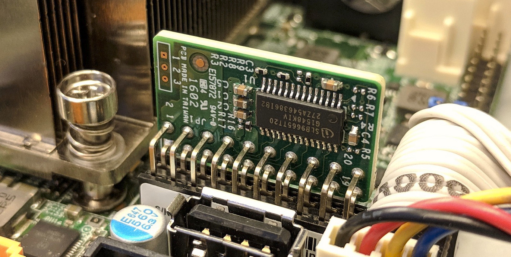
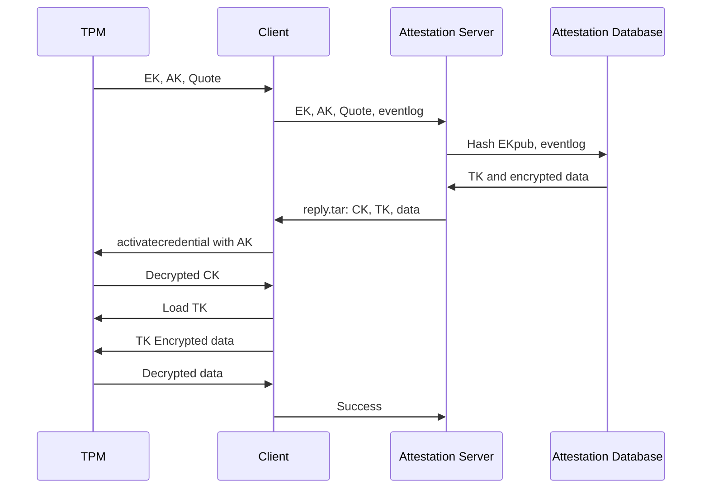
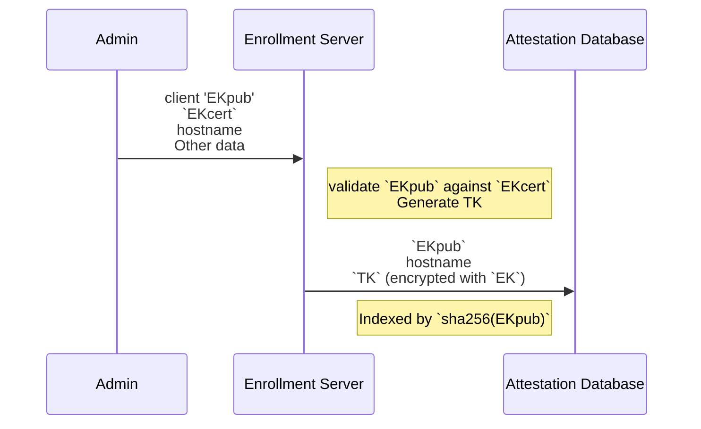
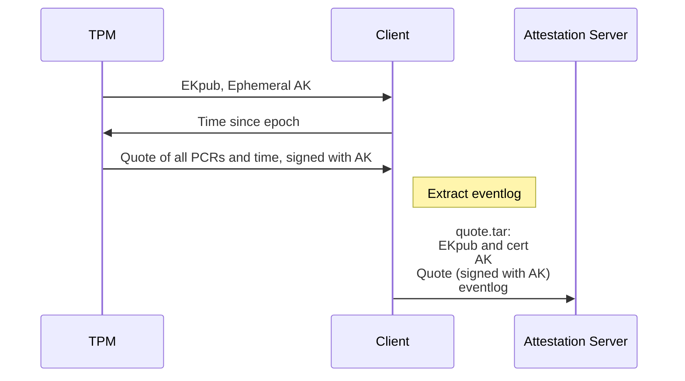
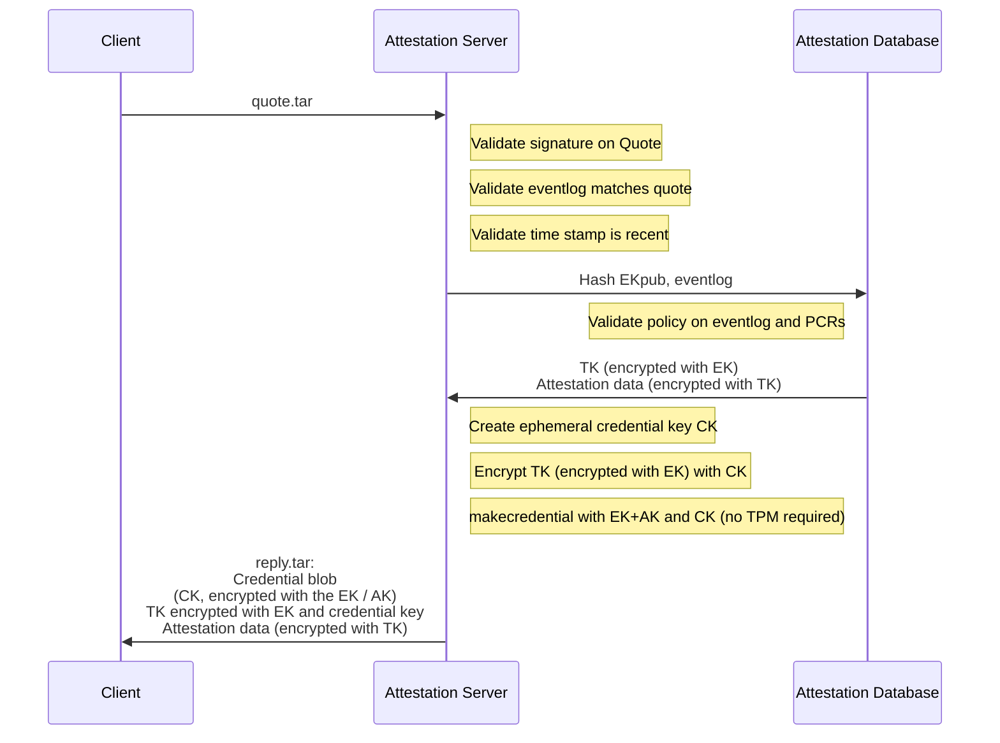
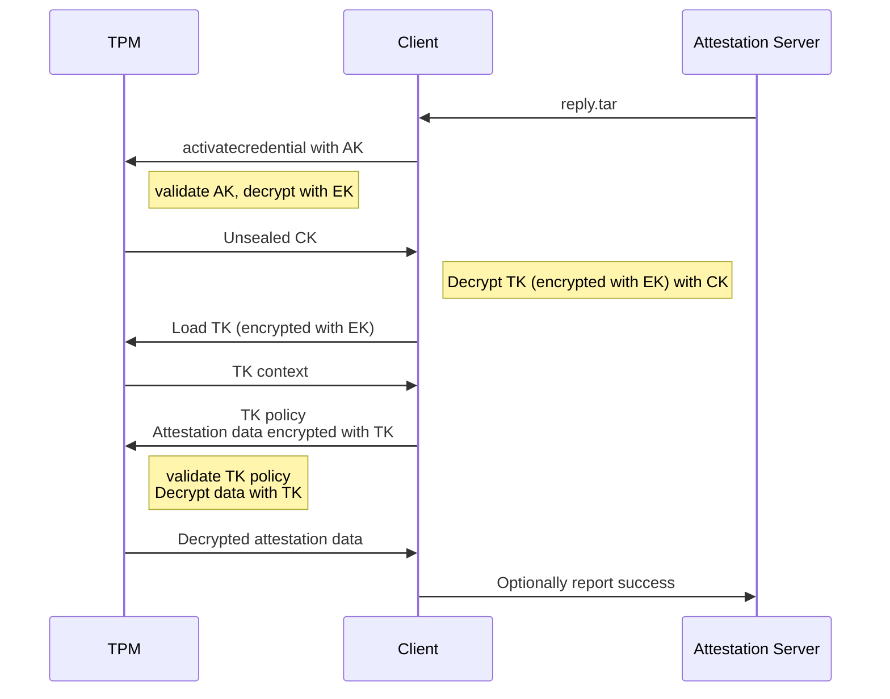

When the user wants to connect to another computer over the network,
they typicaly authenticate with a password and some sort of two factor
token to prove to the remote system that they are authorized to
make the connection.  In high assurance applications, however, it is
also important that the local computer be able to attest to the remote
server that the local computer itself is both authorized and is also
in a known configuration.

The TPM provides a mechanism to do this sort of remote attestation,
similar to the way that the disk encryption keys are "_sealed_" based
on the PCRs and only decrypted if the platform configuration matches
the sealed values.  The `tpm2-tools` package has many of the pieces,
but it is at too low a level for humans to use.  Other parts of the
validation exist in the `openssl` package, but again are not easily
used and require format conversions from the TPM formats.

[`tpm2-attest`](tpm2-attest.md) attempts to wrap all of the various parts of
those two packages into a simple script that provides the four
main attestation functions: sign a quote, validate a signed quote,
seal a secret for a specific TPM, and unseal it with that TPM.

Related to this is [`attest-enroll`](attest-enroll.md), a script that
enrolls a device (e.g., a laptop, a server, etc.) given just its
TPM's endorsement key's public key (`EKpub`) and a name.  Enrollment
can produce and encrypt to that `EKpub` any number of long-term
secrets that are later sent to that device during successful
attestation.

## tl;dr

* Enroll:
    - extract `EKpub`, pick a device name
    - run [`attest-enroll`](attest-enroll.md) (typically via an HTTP
     API) with that `EKpub` and name

* Attest:
    - Client: `tpm2-attest > quote.tar`
    - Client: Send `quote.tar` to server (typically via an HTTP API)
    - Server: `tpm2-attest verify quote.tar | attest-verify` to verify the client's state
    - Server: `tpm2-attest seal quote.tar < enrolled-secrets.tar > cipher.bin`
    - Server: Send `cipher.bin` to client
    - Client: `tpm2-attest unseal < cipher.bin > enrolled-secrets.tar`
    - Client: use `tpm2-recv` to decrypt long-term secrets in `enrolled-secrets.tar`

---------------------

## Attestation protocol



The protocol requires a one round-trip between the local machine
(the client) and the remote attestation server), and all
comunication between the Client and the Server can be in the clear.
There is no sensitive data exchanged -- the `quote.tar` file contains
only public keys and PCR values that are essentially public, and the
`cipher.bin` reply is encrypted with the TPM's Endorsement Key, so it
should only be unsealable by that specific TPM.

A MITM could substitute a different EK/AK pair, although this does
not allow them to masquarade as the TPM of the attesting machine since
they do not have the EK for that TPM, and the real TPM won't be able
to decrypt the response from the attestation server since it would be
encrypted with the wrong EK.

The keys involved are:

* CA Root, stored hopefully securely by the CA
* TPM Manufacturer key, a signing-only key signed by the CA Root, and stored hopefully securely by the OEM
* TPM Endorsement key (`EK`), an encryption key, generated in the TPM(?) and stored in the TPM hardware device
* TPM Endorsement certificate (`ek.crt`), signed by the TPM manufacturer, often stored in the TPM NVRAM
* Attestation Key (`AK`), a ephemeral signing-only key generated by the TPM, but not signed by it (for inexplicable reasons), used to sign the PCR quotes
* Credential Key (`CK`), an ephemeral symmetric encryption key used to protect the reply from the server, encrypted with the `EK` and tied to the `AK` so that only that TPM will decrypt it, and only if the `AK` is a valid key.
* Transport Key (`TK`), a long-term TPM duplicate key used to protect the attestation data. It is stored in the attestation database and encrypted with the client machine's `EK`, and has a policy that allows it to be used only once.

There are two protocols: enrollment, and attestation.  Each protocol
is one round trip.

### Enrollment



* An administrator, or the client itself, sends the client's `EKpub`
  and desired hostname to the enrollment server.
* The enrollment server checks that the client's enrolled state does
  not exist, then it creates it.

  See [`sbin/attest-enroll`](sbin/attest-enroll).

The enrolled state consists of secrets encrypted to the client's
`EKpub` and cleartext metadata.

### Attestation



* Client creates an Attestation Key (`AK`), quotes all the PCRs and
  current time, and sends its `EKpub`, `AKpub`, quote, and eventlog
  to the server.  This is done with

  ```
  tpm2-attest quote > quote.tar
  ```



* The server checks the quote, calls `TPM2_MakeCredential()` with the
  `AKpub` as the activation object, the `EKpub` as the key to encrypt
  to, and an AES-256 session key, and sends back the output as well
  as the enrolled state encrypted in that AES-256 session key.
  This is done with

  ```
  tpm2-attest verify | attest-verify | tpm2-attest seal
  ```


The client recovers the AES-256 session key using
`TPM2_ActivateCredential()` and then decrypts the secrets in its
enrolled state.  This is done with:

```
tpm2-attest unseal
```

then

```
tpm2-recv
```

for each secret.

An optional second round-trip allows the client to prove possession
of the `EK` and `AK`, and this can be used for logging the client's
attestation status.

### Quote validation
When the Server receives the quote file from the client, it runs:
```
tpm2-attest verify quote.tar $nonce
```

With this command the server will:

* Validates the SSL certificate chain on the client TPM EK cert to ensure that it came from a real TPM
* Validates that the quote is signed by the AK with the correct nonce (if the nonce is not checked, then this could be a replay attack by the Client)
* Server optionally consults its list of previously enrolled devices to verify that this EK is in an owner controlled machine
* Server optionally validates that the PCRs match the expected values
* Server optoinally validates that the TPM event log produces the set of
PCR values in the quote

If the command fails, then something is likely wrong on the Client side
and requires remediation.  The Server should not proceed to sealing a
secret for the Client.

Suprisingly, the Attestation Key is not signed by the Endorsement Key,
so the Server has to check the EK certificate to ensure that it came from
a real TPM. Additional, the Server must check the AK attributes to ensure
that it has `fixedtpm` and `sensitivedataorigin` set, which indicates that
the AK was generated inside the TPM. Even with these checks, the Server is
still trusting that the TPM hardware implements `tpm2_activatecredential`
with all of these checks correctly done, since the sealed data is encrypted
with the EK, not the AK.  (Like many things with the TPM2, this is a really
baroque way to organize the keys).


### Secret sealing

Assuming the validation passed, the server can seal secret data such
that only the TPM that produced the signed attestation will be able to
unseal it, and has faith that the TPM will not unseal it if it has been
reset (to prevent attacks that reboot into untrusted firmware):

```
cat secret.txt | tpm2-attest seal quote.tar > cipher.bin
```

With this command the Server will:

* Encrypt a secret message (which could be a disk encryption key, a network access token, or whatever) with the TPM's EK, along with the hash of the AK.

The Server then sends this encrypted blob to the Client.

Note that there is a `verify-and-seal` that combines both the quote validation
and the sealing of the data to the attestation key in one step:

```
cat secret.txt | tpm2-attest seal quote.tar $nonce > cipher.bin
```

### Secret unsealing
Once the Client receives the sealed blob from the Server, it attempts
to unseal it with the Attestation Key context that is left over from the
initial quote signing:

```
cat cipher.bin | tpm2-attest unseal ak.ctx > secret.txt
```

With this command, the Client and TPM will:

* Initiates an encrypted session with the TPM and sends the blob to it.
* The TPM checks that the hash of the AK matches one that it generated and that it hasn't rebooted since then. If these checks pass, the TPM uses its private EK to decrypt the blob.
* Client receives the secret message over the encrypted channel to the TPM

At this point the Client can use the shared secret to authenticate to
the Server, a network, or decrypt it's disk, or whatever.  The TPM is
no longer involved.

---------------------


## TPM OEM Certificates

A key part of the remote attestion is being able to trust that the TPM hardware
is produced by a TPM manufacturer.  Much like SSL Certs for websites, the
TPM's Endorsement Key is signed by the OEM with their Intermediate CA,
which is signed by a Root CA.  Unlike SSL, the Root CAs are often not in
the system's `/etc/ssl/certs/` directory, and not easily accessible online.
Some OEMs publish them in datasheets
([ST TPM EK certificates](https://www.st.com/content/ccc/resource/technical/digital_certificates/tpm_certificates/group0/1b/0c/f0/6a/76/d4/49/5c/DM00213539/files/en.DM00213539.pdf/jcr:content/translations/en.en.DM00213539.pdf)),
some have online portals to select per-device intermediate certs
([Infineon Optiga certificates](https://www.infineon.com/cms/en/product/promopages/optiga_tpm_certificates/)),
and some just say "_Contact manufacturer for more details_"
([Atmel/Microchip EK Configuration](http://ww1.microchip.com/downloads/en/DeviceDoc/Atmel-8872-TPM-AT97SC3205-3205T-TSSOP-Addendum.pdf)).

Luckily Microsoft has a CAB file with all of their approved TPM OEMs in their
[guide to setting up shielded VMs](https://docs.microsoft.com/en-us/windows-server/security/guarded-fabric-shielded-vm/guarded-fabric-install-trusted-tpm-root-certificates).
These x509 certs are in DER format ([and have a few odd ones](https://github.com/MicrosoftDocs/windowsserverdocs/issues/4402)),
so they have been converted to PEM and bundled into `/etc/safeboot/certs/` for
validating the TPM attestations.

### Adding new intermediate certificates
<!--
```
find certs -name '*.crt' -exec \
	openssl x509 -inform DER -outform PER -in '{}' -out '{}'.pem \;
```
-->

If you add your own TPM keys to the directory, you will need to re-build the symlinks
that OpenSSL uses for the `-CApath`:
```
c_rehash /etc/safeboot/certs/
```

### TPMs without EK certificates

Unfortunately not all TPMs store their EK certs in the NVRAM;
some of them require an online query to the OEM to generate the certificate.
There is the `tpm2_getmanufec` program that is supposed to help with this
process, although it hasn't been integrated into this tool yet.
An alternative is to sign the EK with a key under your own control
with `tpm2-attest ek-sign`.  This will produce `ek.crt`, signed with
the safeboot key.  The signing operation can be done out-of-band
on a different machine.

Usually the EK public components can be extracted from the TPM, signed,
and the resulting signed `ek.crt` can be stored back into the TPM nvram.
Note that this will erase an existing OEM cert if you have one!

```
tpm2 createek -c /dev/null -f PEM -u ek.pem
tpm2-attest ek-sign < ek.pem > ek.crt /CN=device/OU=example.org/
tpm2 nvdefine -s 1500 0x1c00002
tpm2 nvwrite -i ek.crt 0x1c00002
```

Google Cloud's ShieldedVM service enables vTPM for the guests, although
it does not provide an EK in the NVRAM either.
The key can be retrieved out of band [with these instructions](https://cloud.google.com/security/shielded-cloud/retrieving-endorsement-key),
or the public component can be read from the `tpm2 createek` command
described above.  Using the [Google Cloud ShieldedVM lookup service](https://cloud.google.com/security/shielded-cloud/retrieving-endorsement-key)
can function as an EKcert as far as establishing trust in an
instance's vTPM.

### Remote attestation demo

Since the quote does not contain any clear text information and the
response is sealed specifically for the TPM that generated the quote,
a simple http server can be used to perform the attestion verification.
A demo in `sbin/attest-server` performs this, using a fixed set of PCRs
and a table of public key to secret mappings for the listed endorsement
keys.

On the server run:
```
./sbin/attest-server secrets.yaml
```

And on the client:
```
tpm2-attest attest http://server-name/ \
	> /tmp/secret.txt \
	|| echo "failed!"
```

---------------------

## FAQ

### Why is this a shell script?

It is often desirable to perform a remote attestion inside of an `initrd`,
where there aren't fancy runtimes for Python or more advanced languages.
So the quote generation needs to be written assuming very limited resources,
as does the response unsealing.

The remote attestation server side could be implemented entirely in a
more civilized language, especially since the Server does not require
any TPM interaction at all -- all of its work is done in software and
can be run as an ordinary user.

As an example of moving some functionality into better languages, the
`tpm2-eventlog-validate` tool that parses the TPM2 event log and generates
expected PCR values is written in Python.


### I thought remote attestation and TPMs were only for DRM?

One of the big fears in the free software community was that TPM's
would be used to lockdown the devices and implement DRM.
That hasn't developed in general purpose computers and
[mjg59's TPM guide concludes with](https://mjg59.dreamwidth.org/24818.html?thread=928242)
"_the current state of technology doesn't make them useful for practical limitations of end-user freedom_".
There's a far bigger threat to user freedom in the locked-down world
of mobile devices; currently most x86 machines allow rekeying with user
keys, so the software (but not the firmware) is still under owner control.

Remote Attestation can be used bidirectionally as well - it allows the
server to attest to the client that the machine is in a trustworthy state.
This is perhaps an even more valuable use case: you might have fairly tight
physical control of your personal machine, but a bare metal server in a data
center is potentially open to attacks by the cloud operator as well as the
previous tenants.  Having attestations as to the firmware and the OS configuration
can make it more trustable.


### Why is generating a quote so slow?

There is lots of traffic between the `tpm2-attest` program and the TPM
during the attestation process, and the TPM is not a fast device.
Read the Endorsement Key (EK) and EK Certificate take a few hundred
miliseconds, signing the quote takes another few hundred, etc.
The process used to take around 20 seconds, since the TPM had to generate
a new RSA Attestation Key (AK) to sign the PCR quote, and generating an RSA
key requires finding large primes with certain values.  The AK was replaced
with ECC, which is much faster to generate.

Creating a new one each time should not be necessary; several attestation protocols
use a pregenerated AK that is persistent in the TPM, except that opens up
a race condition between generating a quote and receiving the sealed
data.  The *quote* includes the reboot count, but the *sealed data*
does not reference it, so the TPM will unseal it if the AK is still
valid, even if an attacker has rebooted into an untrustworthy state
inbetween generating the quote and receiving the sealed response.
By creating an ephemeral AK (with the `stclear` bit set in the
attributes), the TPM will not allow it to be persisted and will refuse
to reload it when the reboot counter increments.


### Discrete TPM vs fTPM?

The Discrete TPM is potentially a hardware weakpoint; a physically
proximate adversary could remove the TPM from a machine and connect
it to an untrusted device and then masquarade as the device to which
the TPM had been connected.  This would also potentially allow them to
extract any sealed disk encryption keys, [as described on the threat
model page](threats.md), and is one of the advantages of an fTPM inside
the Management Engine.

A proximate attacker could also interfere with the LPC
or i2c bus of a Discrete TPM using something like
[the TPM Genie](https://www.nccgroup.com/uk/our-research/tpm-genie/),
which allow them to both modify the hashes sent to the TPM during PCR
extension operations, and read the unsealed secrets when they are returned
if the TPM didn't support secret sessions.

However, the fTPM is a pure-software application inside the ME and
potentially allows an attacker with code execution on the ME to find
the sealing secrets that are used to protect the TPM keys in the ME
NVRAM, which would allow attacks against the quoting and attestation
process.
