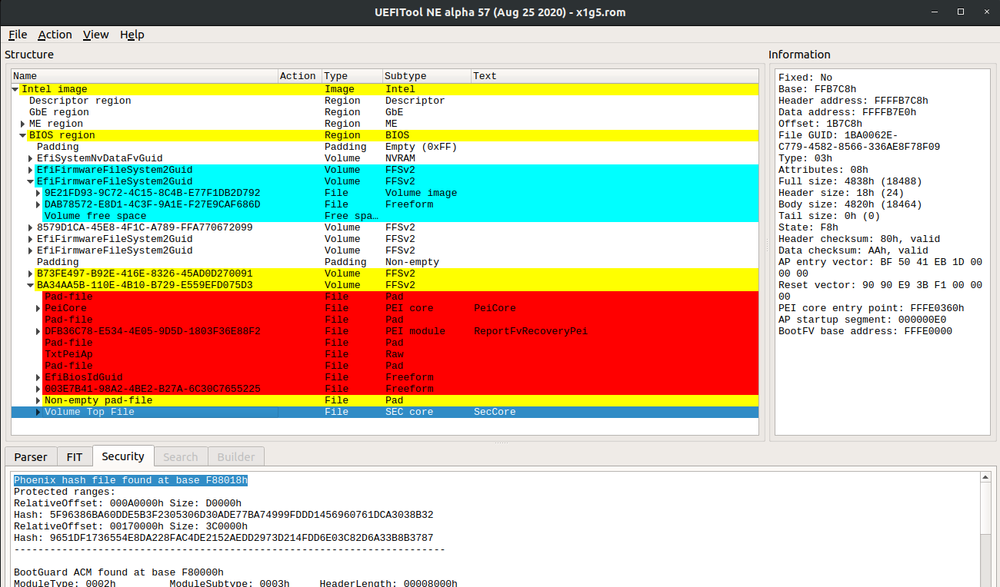

# Chain of Trust

Booting a modern x86 CPU is no longer as simple as it used to be.
This page attempts to document the entire chain of trust and
keys involved in securing the boot process.  It is based on reverse
engineered and observed behaviour, so it may not be entirely accurate.
Hopefully it is still helpful.

## Keys and certificates

* Intel's ME public key hash on die
* Intel's ME public key stored in flash
* Intel's ucode symmetric key (burned into the CPU?)
* Intel's ucode public key hash (burned into the CPU?)
* Intel's ucode public key stored in ucode file in the flash
* Intel's ACM public key hash (in CPU and updatable in microcode?)
* Intel's ACM public key in the ACM header
* OEM Key Manifest Security Version Number (KMSVN, stored in fuses in PCH)
* OEM root public key hash (OTP fuses in the PCH, delivered from ME to x86)
* Bootguard Key Manifest (with KMSVN to protect against rollback) signed by OEM public key 
* OEM root public key in the Bootguard Key Manifest in the flash
* OEM per-model public key stored in Bootguard Key Manifest
* Bootguard Boot Policy, signed by OEM per-model public key
* Bootguard region hashes, stored in Bootguard Boot Policy
* UEFI Platform Key (PK) / Key Exchange Key (KEK) / Database keys (DB) / Revocation Database (DBX)
* CA root key
* TPM OEM root certificate
* TPM OEM intermediate certificate
* TPM Endorsement Key
* TPM Attestation Key
* Linux kernel keyring

## ME Startup

As soon as power is available, the ME boots up from its on-die boot
ROM, checks some straps and fuses to determine its configuration,
and typically then copies the flash partition table from the ME
region of the flash to its on-die SRAM (although `ROMB` fused
chips have limited security). The boot ROM locates the `FTPR`
partition and copies it from the SPI flash into the on-die SRAM. It then
checks that the SHA-1 hash of the key stored in the parition manifest
matches the one in its on-die ROM and validates the RSA signature
on the rest of the partition manifest. The partition table contains
hashes of each of the modules in the partition, allowing the modules
to be validated after they are copied into the on-die SRAM for execution
([Intel ME Flash File System Explained](https://www.blackhat.com/docs/eu-17/materials/eu-17-Sklyarov-Intel-ME-Flash-File-System-Explained.pdf) - Sklyarov et al, BH-EU 2017).

## x86 ucode and ACM

When the ME starts the clocks for the x86 CPU, the on-die microcode fetches the
[Firmware Interface Table (FIT) pointer at `0xFFFFFFC0`](https://github.com/tianocore/edk2-platforms/blob/a89235068ee957828bdb7f1ea3d2fde2546d666a/Silicon/Intel/IntelSiliconPkg/Include/IndustryStandard/FirmwareInterfaceTable.h)
 which points to the FIT table somewhere in the
SPI flash image. This table is then searched for microcode updates that
match the CPU ID. The current microcode copies them from flash in a
linear fashion (into L3 cache?) and decrypts with an on-die symmetric
AES key ([Chen & Ahn 2014](https://www.dcddcc.com/docs/2014_paper_microcode.pdf)),
then validates with (on-die?) RSA key. It's likely that
these ucode updates also contain the key hashes for the ACM.

Next the x86 ucode goes back to the FIT to find the Startup ACM and does
an odd copy of it into L3 (looks like multiple hyperthreads are copying
4KB chunks?). The ACM contains an RSA public key; the ucode compares it
against either an on-die key (hash?) or one stored in the ucode update and
halts the CPU if it does not match. The ucode then checks the signature
on the ACM and again halts if it does not match.

The Startup ACM is supposed to run entirely out of L3, although there
have been bugs ([Bosch & Hudson, 2019](https://trmm.net/TOCTOU))
that allowed a proximate attacker to use devices like the
[Spispy](https://trmm.net/Spispy)
to detect accidental cache misses and TOCTOU the firmware. The ACM
receives the OEM public key hash and Bootguard Profile from the ME via
MSR. (Not certain of the order of operations here).

The ACM reads the BootGuard Key Manifest from the SPI flash (pointed to
by the FIT and identified by `__KEYM__`) into L3 and hashes the
RSA public key stored in it. If it doesn't match the OEM public key hash
or if the OEM public key signature on the Key Manifest or if the stored
KmSvn isn't right, the ACM takes action based on the Bootguard Profile
bits. If it does match, it locates the Bootguard Policy in the FIT (and
identified by `__ACBP__`) and copies it into L3. The ACM then
computes the hash of the RSA public key in the Policy and compares it
to the SHA256 hash stored in the Key Manifest. If that fails to match,
or if the RSA signature on the Policy doesn't match, then the ACM again
takes action based on the Profile settings.

The ACM uses the now validated Bootguard Policy structure to read the
Initial Boot Block (IBB) segments into L3, hashing them as they are
copied (and hopefully not causing any cache misses). If this computed
hash doesn't match the "IBB Digest" in the Policy, the ACM takes action
based on the Profile settings.

## UEFI

After some parts of the UEFI firmware are hashed and validated by
BootGuard, the ACM executes a `GETSEC` instruction to jump to either
the legacy reset vector at `0xFFFFFFF0` or the address in the BootGuard
manifest.  This is typically in the PEI firmware volume and in the
`SecCore.efi` executable with the `VolumeTopFile` GUID.

At this point the chain of trust is now controlled by the OEM and
they are responsible for validating the rest of the firmware.  Usually
they will jump into the Intel FSP to initialze DRAM (on AMD the PSP
has initialized DRAM prior to starting the BIOS, although they have
a separate chain of trust entirely).

Once DRAM is initialized, the `SecCore` copies the DXE firmware volumes
from flash into RAM and computes their hashes.  The major BIOS vendors (IBV)
have their own data structures, such as the AMIHash or PhoenixHash, that
are used to enumerate the regions to be hashed.  This is another common
area of TOCTOU attacks against the boot process.

(Need to document when UEFI capsule updates are searched and when the PRR
are locked to prevent further flash writes)

The UEFI firmware stores non-volatile configuration data in the flash as well.
These "nvram variables" are controlled by the computer owner and begin the
chain of trust transition from the OEM to the owner.  The `SecureBoot` variable
tells the firmware if it should enable UEFI Secure Boot.  If it is set, then
the firmware will attempt to enforce the secure boot policy.

To do this it has a Platform Key (`PK`), which signs the Key-Exchange-Key
(`KEK`), which signs entries in the key database (`db`) as well as
key revocation entries (`dbx`).  Typically the `PK` and `KEK` are
OEM keys (I think) and the `db` is preloaded with Microsoft's key.
Linux distributions and tools like `grub` have paid Microsoft to sign
their bootloaders, which allow them to boot on commodity systems with
UEFI Secure Boot enabled. It is also possible to replace these keys,
and the safeboot project loads an owner controlled key into the PK to
ensure that only owner signed code will be booted.

However, before the firmware can locate the boot disk, which might be
SATA, NVME, USB, or network, it needs to initialize the hardware and
possibly load _Option ROMs_ from devices to configure them.  These Options
ROMs are literally x86 code that is run in ring 0 while the system is
still in a very vulnerable state, so it is important that they be signed.
Option ROMs have been an easy vulnerability for local attackers for many
years (Heasman BH'07, snare BH'12, Hudson 31C3/BH'15).

Once the devices have been initialized, UEFI transitions to the Boot Device Selector
phase (`BDS`), which uses the nvram variables `BootNext`, `Boot0000`, `Boot0001`,
etc to determine which boot loader to use.  The BDS also calls `bs->ExitBootServices()`
to tell the firmware that the OS is about to start, which locks some of the firmware
variables from further updates.

## Linux

(To be added: `shim` protocol?)

Linux has a kernel key ring that is loaded at boot time with the UEFI keys as well
as a compile-time key.  It validates kernel modules with this key.  (To be written)

## TPM

(To be written)
