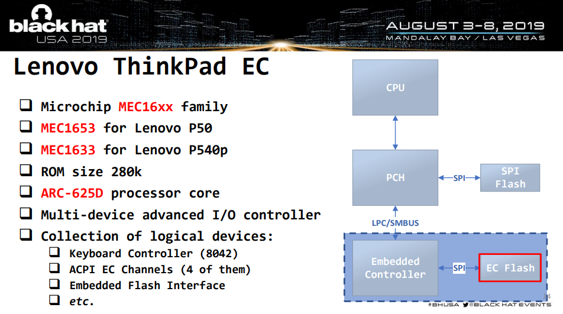

# Frequently Asked Questions

## What is the threat model?

`safeboot` intends to protect the integrity of the boot process and
runtime integrity of the system against adversaries with external physical
access to the device, as well as limited internal physical access.
The assumption is that the attacker can get code execution on the device
as the user and as root, but does not have access to the signing keys
or the disk encryption key. The goal is to prevent the attacker from
exfiltrating data from the device or making persistent changes to the
system configuration.

More details are in [the threat model page](threats.md).

## How is this better than normal UEFI Secure Boot?

`safeboot` is not a replacement for UEFI SecureBoot - the two work together to
improve the security of the system. SecureBoot ensures that the boot firmware is
measured into the TPM and validates the signatures on the Linux kernel and initrd,
and `safeboot` adds additional integrity protections beyond that.

The default UEFI Secure Boot configuration is sufficient for
Microsoft's needs since they are the only signing authority for
their runtime, while Linux computer owners frequently want to
compile their own kernel or runtime.  The compromise solution
developed by Linux distributions has Microsoft sign a
["shim" bootloader](https://mjg59.dreamwidth.org/19448.html)
that has its own key management.  Since most distributions have their
keys enrolled in the shim, systems that have Secure Boot enabled
will boot the distribution's ISOs, which might not be desirable since
it potentially gives an adversary runtime access to unencrypted
parts of the system.

A larger problem is that by default only the Linux kernel is signed,
not the command line parameters or initrd.  While the `grub` bootloader
can enable a password to protect against casual changes to the kernel
parameters, the `grub.cfg` configuration is not typically signed.   This means
that potentially a local attacker can modify it on disk to launch the
kernel with `init=/bin/sh` to drop into a shell, or an attacker with
root access can add trojan'ed binaries to the initrd to gain persistence.
By replacing the Platform Key and removing `grub`, only Linux kernel and
initrd images signed by the computer owner will boot.

Far more details on how `safeboot` extends UEFI SecureBoot are on
[the threat model page](threats.md).

## Does `safeboot` have a BootHole?

BootHole ([CVE-2020-10713](https://cve.mitre.org/cgi-bin/cvename.cgi?name=2020-10713)),
is a vulnerability found and [described by Eclypsium](https://eclypsium.com/2020/07/29/theres-a-hole-in-the-boot/))
in `grub`'s configuration file parsing which allows arbitrary code execution in `grub` even when Secure Boot is enabled.
Kelly Shortridge has a [good writeup by at capsule8](https://capsule8.com/blog/grubbing-secure-boot-the-wrong-way-cve-2020-10713/)
that explains how this threat could be leveraged by an attacker and the difficulties in doing so in
a general case, although an attacker with physical access is able to write to the internal
disk and could launch this attack. Since these sorts of physical attacks are included
in the [`safeboot` threat model](threats.md), it is worth considering.

However, a system using `safeboot` is **not vulnerable to CVE-2020-10713** since
*`grub` is not used at all* and will not be run even if it is present on the disk.
During the `safeboot` installation process, the system owner
[replaces the UEFI Platform Key with their own](install.md#uefi-secure-boot-signing-keys),
which prevents the Microsoft signed shim used by grub from being loaded, and
they then create [`efibootmgr` entries for `linux` and `recovery`](install.md#signed-linux-recovery-kernel)
that are signed with their (hardware protected) key.

Assuming there are not vulnerabilities in the system's UEFI firmware or CPU vendor's BootGuard
(which may not be the best assumption...), the `safeboot` configuration should ensure
that only signed kernel, initrd, and command lines will be booted by the system.
This [static chain of trust](chain-of-trust.md)
helps prevent attacks on `grub` like BootHole, or other ones that modify on-disk
data, from being able to gain persistence or code execution.

One caveat to the protection provided by the UEFI Secure Boot Platform Keys is that
the UEFI NVRAM configuration data is stored in the SPI flash and is also subject to
modifications by a physically proximate attacker with internal access to the hardware.
However, if the attacker uses a flash programmer to change the Platform Keys in the flash,
the TPM measurements of the `Setup` variable will be different and the TPM should refuse
to unseal the disk encryption key since the PCR values will not match the sealed ones.
The adversary might try to roll back to an vulnerable version of the kernel and the
earlier signed PCRs, but the TPM will refuse to unseal since monotonic counter value
will not match the signed one.

An adversary might create a fake PIN entry screen to try to harvest the unsealing PIN
or the recovery key, although in any of these cases, the TPM TOTP six-digit authenicator
value will not be correct since the TPM will not unseal it with modified firmware.
Additionally the system should fail [remote attestation](attestation.md) if it attempts
to connect to a server that validates the TPM quote, improving platform resiliency even
when attackers do gain persistence.

## How does `safeboot` compare to coreboot?

[coreboot](https://coreboot.org) is entirely free software and can
provide far better control of the boot process, although it is not
supported on as many modern platforms as UEFI SecureBoot and requires
reprogramming the SPI flash on the device.  If you have a machine that
supports both coreboot and Bootguard, then you're probably better off
running it instead.  However, be prepared to spend quite a bit of quality
time with your SPI flash programmer to get it working...

Once coreboot or UEFI hand off to the Linux kernel, the TPM unsealing of
the disk encryption key, the dmverity protections on the root filesystem
and the lockdown patches work the same.

## Does `safeboot` work with AMD cpus?

It has only been tested on the Intel systems with Bootguard.
The UEFI platform keys and the rest of the lock down *should*
work with AMD, although AMD's hardware secured boot process hasn't
been reviewed as extensively as Intel's ME and Bootguard.

For an indepth analysis of the AMD Platform Support Processor (PSP)
and SEV, [Buhren, Eichner and Werling's 35c3 presentation](https://media.ccc.de/v/36c3-10942-uncover_understand_own_-_regaining_control_over_your_amd_cpu)
is the most detailed look so far.

## Does safeboot work with Qubes or Xen?

Qubes, a reasonably secure OS, uses the Xen hypervisor to separate device drivers
and applications into separate virtual machines so that an exploit against an individual
component doesn't necessarily compromise the entire machine.  Unfortunately Xen's EFI support
is not commonly used, and as a result running Qubes typically requires Legacy BIOS and
turning off Secure Boot.

Adding Secure Boot support to Xen is possible with some patches
([safeboot-issue #21](https://github.com/osresearch/safeboot/issues/21)),
although it is a work in progress.
There are other factors involved in configuring Qubes to use dm-verity and TPM sealed
secrets that have not been addressed yet, as well as an [open qubes-issue on distribution signing keys](https://github.com/QubesOS/qubes-issues/issues/4371#issuecomment-668639572).

## What causes the TPM unsealing to fail?

The TPM will only unseal the disk encryption key if:

* The policy is signed by the UEFI platform key.
* The PCRs in `$PCRS` match the ones computed by the TPM, which typically include the firmware, UEFI setup variable, UEFI key database, and the PE hash of the kernel + initrd.
* The boot mode PCR in `$BOOTMODE_PCR` matches the sha256 hash of the `safeboot.mode=` kernel command line parameter and has not been extended post-boot.
* The TPM monotonic counter in `$TPM_NV_VERSION` matches the one in the policy.
* The user PIN matches the on used to seal the data.

These requirements are violated by several different attacks, although
they can also fail if a new kernel is installed with `safeboot linux-sign`
and `safeboot pcrs-sign` was not successful.  Typically kernel updates can be
handled seamlessly since the PCR4 value can be predicted from the PE hash of the
new kernel and initrd.

The PCRs will also be different when the system has had a firmware update
from [`fwupd`](https://fwupd.org/) (usually measured into PCR0), or if
the UEFI configuration is changed by the administrator (usually measured
into PCR1 and PCR5).
In both of these cases it is hard to predict what
the resulting PCR values will be, so it is typically necessary to reboot
into the `recovery` target to extend the PCRs with the new measurements
and then update the PCR policy with the new values by running `safeboot
pcrs-sign`.  Some vendors publish the new PCR0 values, and it might be possible
to predict it by evaluating the TPM event log, but it is not guaranteed.

For a fleet of identical systems, however, it is usually possible to do this upgrade
on one offline machine and then distribute the signed kernel along with the signed PCR
policy to the other machines.  This requires some additional work to make practical,
since the TPM counters are not synchronized.

## How is safeboot's SIP related to macOS SIP?

`safeboot`'s System Integrity Protection (SIP) is inspired by the
[read-only filesystems of macOS SIP](https://support.apple.com/en-us/HT204899).
Like macOS, writing to the protected filesystems requires rebooting
with a special kernel command line parameter (in this case `tpm.mode=recovery`)
to enable write access.
Unlike macOS, safeboot SIP can not unseal the disk encryption keys
automatically from the TPM since the boot mode is part of the PCR
measurements, so knowledge of the disk recovery password is required.
This prevents a local adversary who escalates to `root` from being able
to disable SIP and reboot into a writable filesystem to try to gain
persistence.

safeboot's SIP is also inspired by the [Android Verified Boot](https://source.android.com/security/verifiedboot/dm-verity)
that protects Android's `/system` partition.  Like Android, `safeboot` SIP
provides cryptographic protection against an adversary who gains
write access to the filesystem since entire filesystem is protected
by the `dmverity` merkle tree of hashes.  The root hash is signed by
the system owner as part of exiting recovery mode, and this root
hash is passed into the kernel on the command line.
The kernel command line is part of the cryptographic chain of trust
from the CPU boostrap through the Bootguard ACM, into the UEFI firmware,
and all the way to the Linux kernel and initrd.

This is potentially even stronger protection than macOS SIP since it
provides protection even against an adversary with physical access,
the root password and the disk recovery key.  They can't sign the root
hash without the hardware token, and if they change the signing keys in
the firmare, then the TPM will no longer unseal the disk encryption key.
They could re-seal the key with the new PCRs from their fake platform
key, but the system would then fail both the TPM TOTP local attestation
as well as the [remote attestation](attestation.md) when it tried to
prove to an external system that it was in a trusted state.

## How do I write to the root filesystem?

With SIP enabled it is not possible to modify the root filesystem.
You must reboot into recovery mode with `safeboot recovery-reboot`
and decrypt the disk with the recovery password.  Once decrypted,
you can run `safeboot remount` to unlock the raw device and remount
it `rw`.  After making modifications, it is necessary to sign
the new root hashes with `safeboot linux-sign`.

## How do I switch to a new signing key?
There is probably a way to sign a new PK with the old PK, but I haven't
figured it out...  Instead here are the steps:

* Put the UEFI SecureBoot firmware back in `Setup Mode`
* Boot into the recovery kernel
* `safeboot remount` to get write-access to the disk
* `safeboot key-init` or `safeboot yubikey-init` to build a new key.
Answer "`y`" to overwrite the existing one in `/etc/safeboot/cert.pem`.
* `safeboot uefi-sign-keys` to upload it into the firmware
* `safeboot recover-sign`
* `safeboot linux-sign`, which should re-generate the dmverity hashes
* Reboot into the normal kernel
* `safeboot luks-seal` to measure the new PCRs and normal kernel into the TPM

## What happens if I lose the signing key?
The best solution is to authenticate with the supervisor password
to the UEFI Setup, re-enter SecureBoot setup mode and clear the key
database, then boot into recovery mode and follow the instructions
for switching to a new signing key.  If you don't have the
UEFI Supervisor password, well, then you're in trouble.

## Is it possible to reset the UEFI or BIOS password?

On modern Thinkpads the UEFI password is in the EC, not in the
SPI flash.  Lenovo does a mainboard swap to reset it; you could find
a [EC bypass](https://medium.com/@matrosov/breaking-through-another-side-bypassing-firmware-security-boundaries-85807d3fe604)(Matrosov 2019)
or perhaps a [Bootguard bypass](https://pbx.sh/efitoctou/)(Bosch & Hudson, 2019)
to get into Setup in that case.

[Matrosov's 2019 BlackHat Talk](https://www.blackhat.com/us-19/briefings/schedule/index.html#breaking-through-another-side-bypassing-firmware-security-boundaries-from-embedded-controller-15902)
is a deep dive into the Lenovo EC and why it is not as much of a protection boundary
as some vendors think it is.

## Does it work on the Thinkpad 701c?

Unfortunately the wonderful [butterfly keyboard Thinkpad](https://trmm.net/Butterfly)
predates UEFI by a few years, so it does not have a very secure
boot process.  The X1 Carbon is a much nicer replacement in nearly
every way, other than missing the amazing sliding keyboard mechanism.

## ???

Please [file an issue!](https://github.com/osresearch/safeboot/issues)
Or submit a pull-request!
