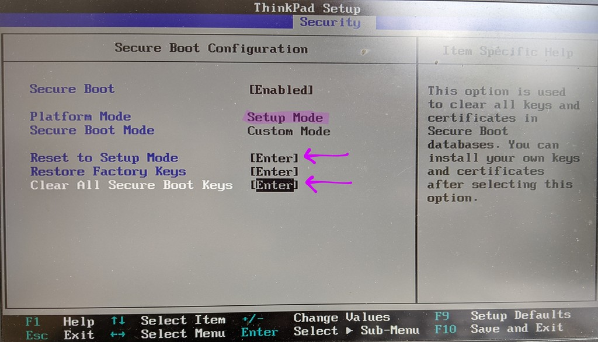

# Safe Boot: Booting Linux Safely

!!! danger
    **Be careful!**
    When following these instructions: it is possible to lock
    yourself out from your own machine if you forget some of the passwords.
    It is best to try this on a non-production system until you're certain
    that you understand how to use the recovery mode to fix bad kernel
    signatures or hashes.

This guide was written for a Thinkpad X1 Carbon Gen 6 running
Ubuntu 20.04.  Unfortunately there has been churn in the `tpm2` tools,
so the Debian package does not work on 18.04.

The outline for configuring safeboot requires some knowledge of the
command line and familiarity with running commands as `root` with `sudo`.
Releases for the the safeboot Debian package are in [safeboot/releases](https://github.com/osresearch/safeboot/releases).

## tl;dr

* Set UEFI SecureBoot setup mode
* Install Ubuntu 20.04, configure encrypted LVM partition
* Resizing '/' to 8GB during the install if you want to enable SIP

```
wget https://github.com/osresearch/safeboot/releases/download/release-0.4/safeboot_0.4_amd64.deb`
sudo apt install safeboot_0.4_amd64.deb`
sudo safeboot yubikey-init /CN=foo/ # or safeboot key-init if you don't have a token
sudo safeboot uefi-key-sign
sudo safeboot recovery-sign
sudo safeboot recovery-reboot

# Should reboot into the recovery image. Login as usual.
sudo safeboot luks-seal`
sudo update-initramfs -u`
sudo safeboot sip-init # if you want to enable SIP mode
sudo safeboot recovery-sign
sudo safeboot recovery-reboot

# Should reboot into the recovery image again, with `/` mounted read-only.
sudo safeboot linux-sign
sudo reboot

# Reboot one more time, now into dmverity protect Linux image...
sudo safeboot luks-seal
sudo reboot
```
After this final reboot, the UEFI SecureBoot database will have the
public signing keys, the UEFI boot manager will have entries for `linux`
(which boots with a read-only dmverity protected root filesystem)
and `recovery` (which boots with a root filesystem that can be remounted
read-write), TPM should contain the disk encryption secret sealed to
the `linux` boot mode, and now the disk should unlock automatically
as long as no one tampers with the device.

For more details as to how this all works, read on...

-----

## Initial Setup
This is done once when the system is being setup to use Safe Boot mode.
Note that the hardware token and key signing portions can be done offline
on a separate disconnected machine and then signed keys copied to the machine.

### UEFI firmware configuration
The goal of these configuration changes are to remove several of the
easy attacks such as booting from external disks, modifying kernel or
initrd on disk, changing kernel command line parameters, as well as some
of the more esoteric ones like DMA attacks against the Thunderbolt ports
during the boot process.

* SecureBoot: Enter setup mode, erase keys
* Supervisor password (do not lose it! it is very difficult to bypass)
* Tamper switches: require supervisor password
* Thunderbolt 3: Disabled
* TPM: Enabled

-----

### UEFI Secure Boot signing keys


UEFI Secure Boot settings that the system will only run bootloaders that
are signed by keys in the SPI flash.  By default these keys are the OEM and
Microsoft, and Microsoft will sign anyone else's key for $99, so it is
important to replace these keys with ones under control of the computer
owner. There is typically a signed "shim" that transfers control to the
unsigned grub bootloader and kernel, which is problematic for security.

A safer way to boot is to package the kernel, initrd and command line
into a single EFI executable that is signed by the computer owner's
key.  This also reduces the attack surface by removing `grub` and
the overly complicated config files, as well as speeds up the boot
process a little bit.

The owner key can be generated by openssl and stored offline, although
using a hardware token like a yubikey greatly enhances the security
of the system since even with root access an attacker can't
gain persistence in the `/` or in the kernel.  

#### OpenSSL key generation

First step is to generate a new key that will be used for UEFI SecureBoot:

```
sudo safeboot key-init /CN=foo/OU=bar/O=example.com/
```

The `key-init` subcommand will generate a password protected RSA2048 key
and store it in `/etc/safeboot/` along with the public certificate.
The password provided here will be required to sign new kernel images
and initrds, so don't lose it!

TODO: What is the purpose of the x509 subject?

#### Yubikey key generation


!!! note
    Skip this if you have already initialized your hardware token and
    enrolled your keys in the UEFI SecureBoot database.
    Running it again will erase the keys from your hardware token.

First step is to generate a new key that will be used for UEFI SecureBoot:
```
sudo safeboot yubikey-init /CN=foo/OU=bar/O=example.com/
```
The `yubikey-init` subcommand will do several steps:

* Use `ykpersonalize` to enable CCID mode. (TODO)
* Generate a new private key inside the Yubikey and export the public key
* Self-sign the public key to generate a new x509 certificate
* Reimport the certificate into the Yubikey so that UEFI variables and images
can be signed with the hardware token.

The public certificate is stored in `/etc/safeboot/cert.pem`. The private
key never leaves the hardware token so it is much more difficult for
an adversary to clone.


#### Enrolling UEFI Platform Keys

Replacing the UEFI Platform Key with the generated x509 cert requires
that the UEFI SecureBoot firmware be put into "`Setup mode`".  On the
Thinkpads, select `Reset to Setup Mode` and `Clear All Secure Boot Keys`,
then boot into Linux.


To load the public key from `/etc/safeboot/cert.pem` into the UEFI
secure boot key database:
```
sudo safeboot uefi-sign-keys
```

Once the key has been generated, the x509 certificate needs to be
reformatted to be added to the UEFI Secure Boot platform key (`PK`),
Key-Exchange Key (`KEK`) and as a key database entry (`db`).  Each
of these updates needs to be signed with the Platform Key; in the
case of the PK it is self-signed.

The `safeboot uefi-sign-keys` subcommand will:

* Generate the three EFI public key variables updates (UEFI platform key (`PK`), key-exchange key (`KEK`) and database (`db`))
* Sign the EFI variables with the Yubikey or OpenSSL key (will require a PIN authentication for each variable)
* Store the signed public certificates into the firmware.

!!! danger
    **Before you reboot!** If you have not signed the kernel and initrd as
    described above, the system will not boot and you will have to disable
    UEFI Secure Boot to get back into the machine.

-----

### Signed Linux recovery kernel


!!! warning
    If you don't have a recovery entry in the EFI boot manager on the disk,
    you would need to have a USB drive signed with a key in the UEFI `db`
    to recover from errors.

The next step is to use the Yubikey or OpenSSL key to sign and install
a recovery kernel, which will be able to read/write mount the root
filesystem, and does not have TPM sealing keys, so it will always require
a recovery password to decrypt the disk.

```
sudo safeboot recovery-sign
```

This command will:

* Add UEFI boot menu item for recovery kernel
* Create a directory for it in the EFI System Partition ("ESP")
* Merge the vmlinux, initrd and command line into a single EFI executable
* Sign the merged EFI executable

Typically you will not have to redo this command since the normal
kernel will be hashed and signed during updates.  The one exception
is that once SIP mode is enabled you will have to resign the
recovery image as well to ensure that it doesn't accidentally write
to the `/` file system and corrupt the hashes.

-----

### TPM Configuration


The command to seal the LUKS disk encryption key into the TPM is:

```
sudo safeboot luks-seal
sudo update-initramfs -u
```

The very first time this is run you will need to also rebuild the initrd
with the new crypttab and hooks in place.
The `luks-seal` subcommand will:

* Create a new disk encryption key with random data
* Read the current PCRs, seal new key into the TPM with these PCRs
* Add new key slot to disk with new key (will require the recovery password)
* Add initramfs building hooks
* Modify `/etc/crypttab` entry to call unlock script if necessary

The Trusted Platform Module serves two purposes in securing the process:
it helps validate that the firmware and boot configuration is unchanged,
and it streamlines the boot process by providing the key for encrypted disks.
On modern systems Boot Guard ensures that the initial boot block is
measured into the TPM, so a local attacker shouldn't be able to modify
the SPI flash contents to bypass the measurements, or to add their
own keys to the UEFI key database.  (Subject to various CVE's and TOCTOUs, etc)

!!! note
    The TPM PCRs are somewhat fragile; they include hashes of the ROM images,
    the EFI executables that have been run along the boot path, etc.
    For example, entering the UEFI `Setup` menu will cause different
    measurements, so the TPM will not automatically unseal on the same
    boot that the user has entered the setup application.

-----

### System Integrity Protection mode


!!! note
    The "SIP" mode is optional and ensures that even an attacker with root
    priviledges can't make persistent changes to the contents of the root
    filesystem. It uses the same dmverity as Android's verified boot mode.

The root of the dm-verity Merkle-tree is passed to the kernel as part of the
signed command line, ensuring that an attacker can't change anything
on the filesystem without access to the signing key.
Any modifications to the filesystem will be detected when the modified
blocks are read, allowing the system to enter recovery mode to protect
its data.

#### RO and RW Partition setup


There is some manual work in a live CD that needs to be done to prepare
the system for SIP mode (since `/` can't be mounted while it is worked on);
it is easiest to do this **before** setting
the SecureBoot config so that you can still boot a stock Live CD.
Ubuntu installer used to allow you to configure the partitions at
install time, but for some reason it no longer does so.

The root filesystem needs to be resized so that hash computation doesn't
take forever, `/home` and `/var` need to be split into a separate mounts,
`/tmp` needs to be a symlink to `/var/tmp`, etc.  So boot into a live CD,
open a terminal and run these commands (change `/dev/sda3` to the physical
disk that you've installed on):

```
sudo cryptsetup luksOpen /dev/sda3 sda3_crypt
sudo vgscan
sudo fsck -f /dev/vgubuntu/root
sudo resize2fs /dev/vgubuntu/root 8G  # This will take a while
sudo lvresize --size 8G /dev/vgubuntu/root
```

Once that is done you can reboot into the system and configure SIP
(which will setup the `/var` and `/home` filesystems, add them to
`/etc/fstab`, relocate `/tmp`, build the initial dmverity hashes,
and add the signed `linux` to the efi boot menu):
```
safeboot sip-init
```


#### Hasing and signing the RO root filesystem


When exiting recovery mode it is necessary to rehash the root filesystem
and sign the kernel command line:
```
sudo safeboot linux-sign
```

The `linux-sign` command will:

* unmount `/` and remount it `ro`
* `fsck /` to ensure that it is clean
* run `veritysetup format` to compute the Merkle-tree for `/dev/vgubuntu/root`
* write the hashes to `/dev/vgubuntu/hashes`
* merge the linux kernel, initrd, and a command line with the dmverity root hash into an EFI executable
* sign this executable
* and install it as the default entry in the EFI boot manager

Because this might change the EFI boot manager, it is necessary to
reboot into the SIP mode and then re-seal the TPM key with
`safeboot luks-seal` as documented above.

TODO: Detect changes and notify the use rather than just `EIO`.

<!--
* For dm-verity and read-only root:
* Separate `/`, `/var` and `/home`
* (need to show how to do this post install for 20.04)
* Two copies of `/` for A-B switching and atomic updates
-->

## Updates
Nothing ever stays static, so it is important to consider the steps
for updating the system.  Frequently the root file system and kernel
will be updated together, so these steps can be batched.  Hopefully
TPM re-sealing doesn't have to happen as often, since it requires
access to the disk encryption recovery key.

### Root filesystem updates

To re-enter recovery mode, remount the `/` filesystem read/write
and re-hash the filesystem for normal mode:

```
sudo safeboot recovery-reboot
# enter the disk recovery password and login
sudo safeboot remount
# do stuff to / like apt-get ...
sudo safeboot linux-sign
reboot
```

The `recovery-reboot` and `remount` subcommands:

* Set the UEFI Boot Manager `BootNext` to `recovery`
* Reboot the machine
* Require a manual disk decryption recovery code
* Runs `blockdev --setrw` to re-enable writes to the root device
* Runs `mount -o rw,remount /` to re-enable writes to the root filesystem

After updating the file system with tools like `apt install ...`,
the `linux-sign` subcommand will:

* Run `mount -o ro,remount /` to make the root filesystem readonly
* `fsck /` to ensure that it is clean
* `veritysetup format` to compute the merkle-tree
* Use the Yubikey or OpenSSL key to sign the merkle-tree root hash
* Reboot to the new read-only runtime

If you are maintaining a fleet of machines, these could be done offline
and the block image pushed to the system for installation.

### Kernel and initramfs update
* Re-generate `/boot/initrd` and `/boot/vmlinuz`
* Merge the kernel, initrd and command line into a single EFI executable
* Use the hardware token to sign that executable
* Copy the signed image to the EFI boot partition
* These could be done offline and the block image pushed to the system for installation

### UEFI firmware update
If there are any updates to the UEFI firmware, such as changing the
`Setup` variable, then the TPM sealed keys will no longer be accessible
and the recovery key will be necessary to re-seal the drive.  This
requires access to the recovery key since a new random key is generated
and needs to be stored into a keyslot on the drive.
