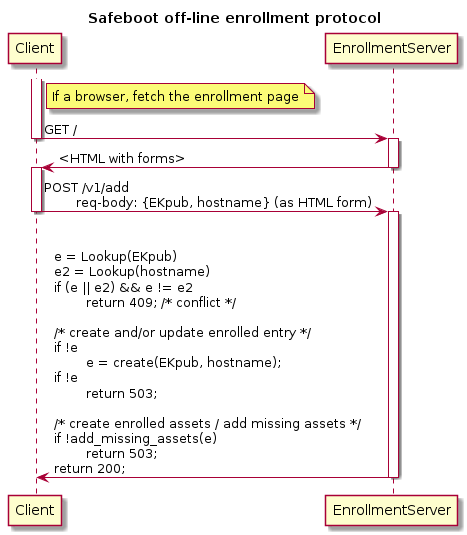
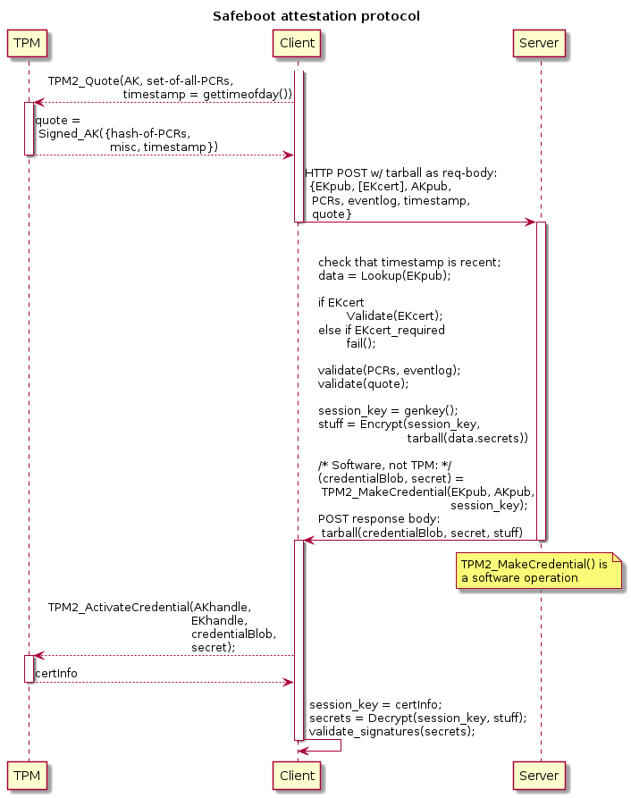

# Safeboot.dev Enrollment, Attestation, and Proof-of-Possession Protocols

This document describes the Safeboot.dev enrollment and attestation protocols.

These protocols are based on the Trusted Computing Group's (TCG) Trusted
Platform Module (TPM), using a discrete TPM or a firmware TPM to secure
enrollment and delivery of secrets to enrolled devices.  The use of a TPM helps
provide decent assurance of device state at certain times, provides us with a
way to bootstrap trust.

The Safeboot.dev enrollment protocol creates long-term state for an enrolled
device, including secrets/credentials needed by the device.  The Safeboot.dev
attestation protocol conveys enrolled state to devices that demonstrate being
in good state.

> NOTE: The protocol is described as it will soon be.  Specifically, the use of
> digital signatures for authentication of long-term enrolled assets is not yet
> integrated.  See [Pull Request #140](https://github.com/osresearch/safeboot/pull/140).

## Goals

 - protocol specification sufficient for
 - security review

## Background

The security of the Safeboot.dev protocols depends critically on the use of
TPMs.  Reviewers must be familiar with some of the relevant TPM concepts listed
below.

Some useful links:

 - [Introduction to TPMs](https://github.com/tpm2dev/tpm.dev.tutorials/tree/master/Intro)
 - [Device Enrollment](https://github.com/tpm2dev/tpm.dev.tutorials/tree/master/Enrollment)
 - [What Attestation Is](https://github.com/tpm2dev/tpm.dev.tutorials/tree/master/Attestation)

### Critical Background

It is essential that readers understand:

 - [`TPM2_MakeCredential()`](https://github.com/tpm2dev/tpm.dev.tutorials/blob/master/TPM-Commands/TPM2_MakeCredential.md)
 - [`TPM2_ActivateCredential()`](https://github.com/tpm2dev/tpm.dev.tutorials/blob/master/TPM-Commands/TPM2_ActivateCredential.md)
 - [Cryptographic object naming](https://github.com/tpm2dev/tpm.dev.tutorials/tree/master/Intro#cryptographic-object-naming)

Readers should also have a passing understanding of how authorization works in
a TPM 2.0 as well, especially when a TPM requires a caller to execute some
authorization policy, and which policy.

Readers must be familiar with the `TPM2_MakeCredential()` /
`TPM2_ActivateCredential()` constructs.  We describe these somewhat here.

`TPM2_MakeCredential()` is an operation that amounts to encryption of a small
secret to a public key, but with a binding to the cryptographic name of an
"activation object".  `TPM2_ActivateCredential()` decrypts such ciphertexts
provided that:

1. the caller has access to the private key to whose public key
   `TPM2_MakeCredential()` encrypted the payload,
2. and that the caller has access to the "activation object" named by the
   caller of `TPM2_MakeCredential()`.

As the cryptographic name of an object binds to it any authorization policies
associated with use of that object, the caller of `TPM2_ActivateCredential()`
must meet that policy.

This means that the caller of `TPM2_MakeCredential()` can require specific
authorization and other attributes -via the activation object's name- that the
caller of `TPM2_ActivateCredential()` must satisfy.

For example, a device that will call `TPM2_ActivateCredential()` can supply the
activation object's public key to the peer that will call
`TPM2_MakeCredential()`, then that peer can combine the activation object's
public key with the attributes expected of the activation object to cause the
protocol to succeed IFF the possessor of the activation object created it with
those same attributes.

> NOTE: The activation object's private key is not itself used for any
> cryptographic operations in `TPM2_ActivateCredential()`.  Only the activation
> object's cryptographic name and its attributes are used.

> NOTE: The `TPM2_MakeCredential()` function can be implemented entirely in
> software, as it requires no privileged access to any objects stored in any
> TPMs.

> NOTE: It is essential to the security of the Safeboot.dev protocols that
> enrolled devices' TPMs be legitimate TPMs or virtual TPMs run by trusted
> agents.  This is due to the protocol depending on the TPM to enforce
> authorization policies for certain functions that an untrusted implementation
> could forgo.

### Other TPM Background

Some less critical TPM background:

 - [Hash extension](https://github.com/tpm2dev/tpm.dev.tutorials/tree/master/Intro#hash-extension)
 - [Platform Configuration Registers (PCRs)](https://github.com/tpm2dev/tpm.dev.tutorials/tree/master/Intro#platform-configuration-registers-pcrs)
 - [Root of Trust Measurement (RTM)](https://github.com/tpm2dev/tpm.dev.tutorials/tree/master/Intro#root-of-trust-measurements-rtm)
 - [Authorization](https://github.com/tpm2dev/tpm.dev.tutorials/tree/master/Intro#authentication-and-authorization)
 - [Key hierarchies](https://github.com/tpm2dev/tpm.dev.tutorials/tree/master/Intro#key-hierarchies)

## Terminology

We will use a lot of terminology from the TCG universe.

In particular we will speak of:

 - credential

   Depending on the context, "credential" will refer either to:

   a) a secret or private key and possibly some metadata which can be used to
   access some remote resources -- for example, a PKIX certificate and private
   key --,

   b) a small secret key -typically an AES key- encrypted with
   [`TPM2_MakeCredential()`](https://github.com/tpm2dev/tpm.dev.tutorials/blob/master/TPM-Commands/TPM2_MakeCredential.md).

 - credential activation

   The successful use of
   [`TPM2_ActivateCredential()`](https://github.com/tpm2dev/tpm.dev.tutorials/blob/master/TPM-Commands/TPM2_ActivateCredential.md)
   to recover a small secret.

 - activation object

   A TPM entity whose cryptographic name is used in making a "credential" with
   [`TPM2_MakeCredential()`](https://github.com/tpm2dev/tpm.dev.tutorials/blob/master/TPM-Commands/TPM2_MakeCredential.md),
   and a handle and authorization session to which will be provided by the
   caller of
   [`TPM2_ActivateCredential()`](https://github.com/tpm2dev/tpm.dev.tutorials/blob/master/TPM-Commands/TPM2_ActivateCredential.md)
   to recover the credential.

## Use Cases: Secure Boot, Device Credential Provisioning

The Safeboot.dev enrollment and attestation protocols support two use cases:

 - secure boot
 - device credential provisioning

These two uses differ only in whether the enrolled device is expected to
perform UEFI secure boot.

In all cases Safeboot.dev enrollment is about creating sensitive
files/blobs/assets that are stored encrypted to the device's TPM and to escrow
agents.

In all cases Safeboot.dev attestation is about delivering enrolled assets to
devices in trusted state.

### Use Cases: Secure Boot

This use-case involves the device encrypting local storage with a secret
long-term key obtained at boot time via the attestation protocol.

### Use Cases: Device Credential Provisioning

This use-case involves delivering to the device credentials such as:

 - private keys and PKIX certificates for their public keys (for, e.g., TLS and/or IPsec)
 - Kerberos keys ("keytabs")
 - OpenSSH host keys and certificates
 - service account tokens of various kinds

### Use Cases: Secure Boot and Device Credential Provisioning

Naturally, both of these use cases can be combined.  In fact, they are the same
use case, differing only in the nature of the material delivered to the client.

### Use Cases Currently Out of Scope

Other attestation protocols are meant to be used not just at boot time but very
often, and not so much for delivering device credentials to the client device
as for ascertaining the continued trusted state of the client device.  Devices
that fail to attest successfully and often enough might, e.g., be locked out of
the network.

Such protocols may depend on having some dynamic state on the server side.  For
example, keeping track of the last time that a client attested, its TPM's
`resetCount` (to make sure it never goes backward, and to detect reboots), etc.

Nothing about Safeboot.dev's protocols precludes the use of other attestation
protocols for purposes other than the use cases listed above.  Nothing about
Safeboot.dev's current protocols precludes the addition to Safeboot.dev of
functionality similar to those other projects' attestation protocols'.

# Threat Model

The primary threats that the Safeboot.dev enrollment and attestation protocols
seek to protect against are:

 - theft of devices and/or their local storage
 - passive attacks on the attestation protocol
 - active attacks on the attestation protocol
 - any attacks on the enrollment protocol

## Assumptions

We assume that:

 - enrollment and attestation servers are physically secure
 - access to enrollment and attestation servers is secured
 - the credentials held by enrollment and attestation servers are secure
 - the enrollment database and any associated servers are secure
 - read access to the enrollment database can be secured
 - enrollment database protocols are secure

## Threat Models Out of Scope

The following threats are out of scope for this document:

 - any attacks on the attestation server (other than via attacks on the
   attestation protocol)
 - any attacks on the enrollment database
 - any attacks on the enrollment server (other than via attacks on the
   enrollment protocol)
 - post-attestation attacks on devices

# Architecture

The Safeboot.dev architecture consists of two separate protocols: one for
enrollment, and one for attestation.

The Safeboot.dev attestation protocol operates using state created at
enrollment time.

Enrollment is the act of creating state binding a device's TPM and a name for
that device, as well as creating any secrets and/or metadata that that device
may repeatedly need in the environment it will be used in.

The separation of enrollment and attestation is motivated by:

 - privilege separation considerations

   We'd like to isolate any issuer credentials to as few systems as possible,
   while allowing the attestation service to be widely replicated.

   Because enrollment is a low-frequency event, while attestation a
   high-frequency event, we can have fewer enrollment servers and more
   attestation servers.  Then we can isolate issuer credentials by placing them
   only on enrollment servers.

 - database replication and write concurrency considerations

   Having state created and manipulated only at enrollment servers allows us to
   replicate the enrollment database to attestation servers as a read-only
   database.

   Together with the low frequency of enrollment events this frees us from
   having to address concurrent database updates at this time, at the cost of
   having primary/secondary enrollment server roles.

> Any future evolution of Safeboot.dev towards more dynamic attestation state
> may well use separate databases for enrolled assets and attestation state.
> Our interest in privilege separation does not preclude such an evolution, as
> the separation between one database type and the other would tend to fulfill
> that interest.

# Enrollment Protocol

The enrollment protocol cosists of an HTTP API called over HTTPS:

 - `/v1/add` -- `POST` here to enroll, as described above
 - `/v1/find` -- `GET` here to query the enrolled device database by `hostname`
 - `/v1/query` -- `GET` here to query the enrolled device database by `EKhash`
 - `/v1/delete` -- `POST` here to delete an enrolled device's database entry

All of these end-points are 1 round trip, naturally (except where HTTP
authentication methods used require more round trips).

The `/v1/add` and `/v1/delete` end-points expect an HTML form to be posted.

The `/v1/find` end-point expects a single query parameter to be given:
`hostname`, with a hostname prefix.

The `/v1/query` end-point expects a single query parameter to be given:
`ekpubhash`, with a hash of `EKpub` prefix.

The `/v1/add` end-point takes two inputs from the client, delivered as an HTML
form over an HTTPS POST:

 - `hostname` -- the desired device name
 - `ekpub` -- the device's TPM's endorsement public key (`EKpub`), either in
   `TPM2B_PUBLIC` or `PEM` formats (either as a public key or as a
   certificate)

An `EK` certificate is preferred, as that can be validated by checking that its
issuer chains to a trusted TPM vendor root certification authority (CA).  In
environments such as the Google compute cloud's Shielded VMs, there may not be
an `EK` certificate available, but instead an API may be available to validate
an `EKpub`.

User authentication and authorization MAY be required if only certain users
should be allowed to enroll devices.  The choice of HTTP authentication method
is not specified here (options include Negotiate, Bearer, OIDC, SCRAM, etc.).

The enrollment server ensures that the creation of the binding of device name
and `EKpub` is made atomically.

> NOTE: In a putative future where multiple enrollment servers can concurrently
> create these bindings, we may dispense with atomic bindings; instead a
> conflict resolution mechanism MAY be used to resolve conflicts.

The enrollment server will also provision the device with any number of secrets
and metadata of various kinds that will be transported to the device during
attestation.  These are stored encrypted at rest (more on this below).

No request or response headers are used.  No universal resource identifier
(URI) query-parts are used.  The URI local-part need only denote that it is the
enrollment end-point.  We are using the following URI local-parts:

## Types of Secrets and Metadata Provisioned

Various types of long-term secrets and metadata can be provisioned to an
enrolled device:

 - configuration
 - early boot scripts
 - symmetric keys (or passphrase) for local storage encryption
 - private keys and PKIX certificates for them (client, server) for TLS, IPsec, etc.
 - Kerberos keys ("keytab")
 - service account tokens
 - IPsec keys for manually keyed SAs
 - etc.

> IMPLEMENTATION NOTE: These are configurable as `genprog`s for the
> `sbin/attest-enroll` program.  See its usage message.

## Data-at-Rest Encryption

All these secrets created by the `/v1/add` end-point are encrypted to the
device's TPM's `EKpub` and separately also encrypted to the public keys of
configured escrow agents for, e.g., break-glass recovery.

For every secret asset the server generates a random AES-256 key.  The
plaintext of the secret to be encrypted is then encrypted using the AES-256 key
in an authenticated encryption cipher mode.  See
[Appendix-A](#Appendix-A-Symmetric-AEAD-Cipher-Mode-Confounded-AES-256-CBC-HMAC-SHA-256).

The AES-256 key is then encrypted to the enrolled device's `EKpub` and to any
configured escrow agents' public keys.

## Encryption to Escrow Agents

Encryption to escrow agents is done using raw RSA public keys.

## Encryption to Device `EKpub`

All these secrets are encrypted to the device's TPM's `EKpub`, each with an
optional, configurable TPM authorization policy.  Two mechanisms can be used
for encryption to a device's TPM: the "WK" and "TK" mechanisms.

A TPM authorization policy is a TPM 2.0 enhanced authorization (EA) policy, and
will be enforced by the device's TPM when called to decrypt one of these
secrets.

The default policy for the `rootfs` key (a symmetric key for local storage
encryption) is that the platform configuration register (PCR) #11 must have the
initial value (all zeros), with the expecation that the attestation client will
immediately extend PCR #11 (with no particular value -- just some value) so
that the TPM will not again decrypt the same ciphertext unless the device
reboots.

Policies are configurable for each secret type.

> NOTE: We could use well-known PCR#11 extension values for the purpose of
> creating specific time windows during the boot process during which different
> secrets could be decrypted.

> NOTE: Both, the WK and TK methods offer equivalent functionality.  We support
> both mainly for historical reasons.  The WK method is simpler, but the TK
> method was implemented first.

### Encryption to TPM `EKpub`: WK Method

> NOTE: Readers are expected to understand the `TPM2_MakeCredential()` and
> `TPM2_ActivateCredential()` functions.  See the [Critical Background
> section](#Critical-Background).

1. A well-known public key (`WK`) is loaded into a software TPM using
   `TPM2_LoadExternal()` with the desired policy's `policyDigest`.

2. `TPM2_MakeCredential()` is called with these input parameters:
    - the `WKpub` (the loaded WK) as the `objectName` input parameter,
    - the device's `EKpub` as the `handle` input parameter,
    - and the AES-256 symmetric key as the `credential` input parameter (the
      plaintext).

The outputs of `TPM2_MakeCredential()` (`credentialBlob` and `secret`) make up
the ciphertext of the AES-256 key encrypted to the TPM's `EKpub`.

The details of what `TPM2_MakeCredential()` does are described in the [TCG TPM
2.0 Library part 1: Architecture, section 24 (Credential
Protection)](https://trustedcomputinggroup.org/wp-content/uploads/TCG_TPM2_r1p59_Part1_Architecture_pub.pdf).

Decryption is done by calling `TPM2_ActivateCredential()` on the TPM that has
the `EK` corresponding to the `EKpub`.  Critically, the TPM will refuse to
"activate" the credential (i.e., decrypt the ciphertext) unless the caller has
satisfied the WK's `authPolicy` (if set).

To decrypt, access to the TPM identified by the `EKpub` is needed.  The process
is as follows:

 - call `TPM2_LoadExternal()` the well-known key, with the desired
   `authPolicy`, if any
 - call `TPM2_StartAuthSession()` to create a policy session for the `EK`
 - call `TPM2_PolicySecret()` to obtain access to the `EK`
 - call `TPM2_StartAuthSession()` to create a policy session for the `WK` (if
   the `WK` had a `policyDigest` set)
 - call the policy commands on the `WK` session handle to satisfy its policy
   (if one was set)
 - call `TPM2_ActivateCredential()` with the loaded `WK` as the
   `activateHandle` and its corresponding policy session, the `EK` as the
   `keyHandle` and its corresponding policy session, and the ciphertext
   (`credentialBlob` and `secret`) as input parameters

The `WK`'s authorization policy, if set, is enforced by
`TPM2_ActivateCredential()`.

Then, once the AES-256 key is decrypted, the confounded AES-256-CBC-HMAC-SHA256
ciphertext is decrypted as described above.

### Encryption to TPM `EKpub`: TK Method

1. create an RSA key-pair in software
2. encrypt the AES-256 key to the RSA public key using OEAP with any software
3. use a software TPM to encrypt the RSA private key from (1) to the `EKpub` of
   the target TPM using `TPM2_Duplicate()`, setting the desired policy's
   `policyDigest` as the intended `authPolicy` of the RSA key as it will be
   when loaded by the target TPM
4. the ciphertext then consists of a) the ciphertext from encryption to the RSA
   public key, b) the outputs of `TPM2_Duplicate()`

To decrypt, access to the TPM identified by the `EKpub` is needed.  The process
is as follows:

 - call `TPM2_StartAuthSession()` to create a policy session for the `EK`
 - call `TPM2_PolicySecret()` to obtain access to the `EK`
 - call `TPM2_Import()` and `TPM2_Load()` to import and load the output of
   `TPM2_Duplicate()`
 - call `TPM2_StartAuthSession()` to create a policy session for the `TK` (if
   the `TK` had a `policyDigest` set)
 - call the policy commands on the `WK` session handle to satisfy its policy
   (if one was set)
 - call `TPM2_RSA_Decrypt()` to decrypt the AES-256 key with the imported `TK`

The `TK`'s authorization policy, if set, is enforced by `TPM2_RSA_Decrypt()`.

Then, once the AES-256 key is decrypted, the confounded AES-256-CBC-HMAC-SHA256
ciphertext is decrypted as described above.

## Break-Glass Recovery

Break-glass recovery consists of:

1. replacing a device's TPM or the device itself (including its TPM),
2. decrypting the secret AES-256 keys stored in the enrollment DB using an
   escrow agent,
3. encrypting those to the new TPM's `EKpub`,
4. and replacing the corresponding ciphertexts in the enrolled device's entry
   in the enrollment DB.

Any break-glass recovery operations must be performed only by authorized users.

# Attestation Protocol

The Safeboot.dev attestation protocol is a single round trip protocol that
allows a device to obtain its enrolled assets from the attestation server in
exchange for successfully attesting to the device's state.

State that can be attested:

 - recency -- via a timestamp
 - that the caller has access to the `EK`
 - the values of PCRs, which reflect the firmware ROMs and operating system
   loaded
 - the TPM's `resetCount` (count of reboots)
 - anything that can be required by a TPM policy

To attest its state, a client device first generates an "attestation key"
(`AK`) -- an asymmetric signing keypair.  This object must have the `stClear`
attribute set, which means that the TPM will refuse to reload or re-create this
`AK` if the TPM is reset (which happens when the host device reboots).  It must
also have the `fixedTPM`, `fixedParent`, and `sign` attributes set.  Then the
client creates a "quote" of all the PCRs, signed with the `AK`.  See
[`TPM2_Quote()`](https://github.com/tpm2dev/tpm.dev.tutorials/blob/master/TPM-Commands/TPM2_Quote.md).

The attestation protocol consists of an HTTP POST (HTTPS not required) with:

 - `/v1/attest` as the end-point
 - no particular request headers
 - no URI query-parameters
 - no HTTP authentication needed
 - the request body consisting of an uncompressed `tar` file containing the
   following items:

    - `ek.crt` -- the `EKcert`, that is, the PKIX certificate for the TPM's
      endorsment key (EK) as provisioned by the TPM's vendor (this is optional,
      present only if the TPM has an `EKcert`)

    - `ek.pub` -- the `EKpub` in `TPM2B_PUBLIC` format

    - `ak.pub` -- the `TPM2B_PUBLIC` representation of the `AK`

    - `ak.ctx` -- the `AK` object, saved to help make it easier for the client
      to keep state

    - `quote.out`, `quote.sig`, and `quote.pcr` -- the outputs of `TPM2_Quote()`
    - using the `AK`

    - `nonce` -- not actually a nonce but a timestamp as seconds since the Unix
      epoch

    - `eventlog` -- if possible, this is the TPM PCR eventlog kept by the UEFI
      BIOS

    - `ima` -- if possible, this is the Linux IMA log

The attestation server then:

 - looks up the device's enrollment DB entry by the given `EKpub`
 - examines the `ak.pub` to ensure that it has the desired attributes
   (specifically:
    - `sign`
    - `fixedTPM`
    - `fixedParent`
    - `stClear`
   and recomputes the `AK`'s cryptographic name for later use as the activation
   object name request parameter of `TPM2_MakeCredential()`
 - verifies that the eventlog matches the PCRs
 - verifies that the digests that appear in the eventlog are acceptable, or
   that the PCRs match "golden PCRs"
 - examines the `nonce` to verify that it is a recent timestamp

If all the validation steps succeed, then the attestation server:

 - generates an ephemeral AES-256 session key,
 - constructs a tarball of the device's long-term enrolled assets from the
   device's enrollment database entry,
 - encrypts that tarball in the session key,
 - encrypts the session key to the device's TPM's `EKpub` using
   `TPM2_MakeCredential()` with the `AKpub`'s cryptographic name as the
   `objectName` and the `EKpub` as the `handle`

In the successful case, then, the response body is a tarball consisting of:

 - `credential.bin` -- a file containing the `credentialBlob` and `secret`
   output parameters of the `TPM2_MakeCredential()` call
 - `cipher.bin` -- the ciphertext of a tarball of the device's enrollment DB
   entry, encrypted with the AES-256 session key using confounded
   AES-256-CBC-HMAC-SHA-256 as described above.
 - `ak.ctx` (as provided by the client, sent back)

The client can decrypt and recover the AES-256 session key IFF it has a TPM
with the corresponding `EK` and `AK` loaded.

Having recovered the AES-256 session key, the client can decrypt the tarball of
the client's long-term secrets and metadata, where the secrets are encrypted to
the client's TPM using the WK or TK methods.  The client can then decrypt the
secrets whose policies it can satisfy.

The client is expected to immediately extend PCR #11 so that long-term secrets
whose policies expect PCR #11 to be in its initial state (all zeros) cannot
again be decrypted with the client's TPM without first rebooting.

> Note that we use the server uses `TPM2_MakeCredential()` to construct the
> response, much like the "WK method" of encrypting secrets, with these
> differences:
> 
> - the client's ephemeral `AKpub` is used to construct the `objectName` input
>   parameter,
> 
>   (This means that if the client reboots it will not be able to decrypt this
>   response with `TPM2_ActivateCredential()` because the `AK` had `stClear`
>   set, which means it cannot be recovered if the TPM is reset.)
> 
> - the `objectName` does not involve a `policyDigest`
> 
> - the ciphertext is not a long-term stable ciphertext but one made with an
>   ephemeral AES-256 session key.

# Authentication of Enrolled Assets

All enrolled assets are signed by a private key on the enrollment server at the
time that the assets are created.

Attestation clients validate these signatures after successful attestation and
conveyance of enrolled assets to the attestation client.

Signatures can be made with a bare key, or they can be made with a certified
key.  In the former case the attestation client must know the public key to
validate the signatures with.  In the latter case the attestation client must
know a PKIX trust anchor for validating the enrollment server's certificate and
certificate chain.

# Proof-of-Possession Protocol

TBD (not yet designed or implemented).

Attestation clients cannot recover their secrets unless they are in the
attested state, or unless they ran untrusted code and locally saved their
enrolled assets from a previous attestation.  The attestation server currently
receives no confirmation of that state after the fact, but knows that the
client can recover its secrets IFF its attestation is correct because the
client's TPM will enforce the binding between the client's `EK` and `AK`, and
any policies needed to decrypt the client's enrolled assets.

> We are considering chaining instances of the attestation protocol where each
> instance proves activation of the preceding instance's credential.  Thus the
> proof-of-posession (PoP) protocol would be the same as the attestation
> protocol.

> We might also use attestation chaining in this way to implement continuous
> (frequent) attestation.  We can then keep some mutable per-device state,
> mainly the `resetCount`, time of last good attestation, and a sequence number
> of the last good attestation.

## Use Cases for PoP Protocols

 - logging and alerting

 - unlocking attested device access to a wider network

 - locking out of the network devices that fail to attest frequently

# Enrollment Database

> NOTE: Nothing here formally specifies a schema for this database.  This
> content is supplied only to help reviewers.

The enrollment server creates state that is shared with attestation servers.
Attestation servers need only read access to that state.  We shall call that
state a "database".  Many options exist for representing the enrolled device
database:

 - relational (e.g., any SQL server)
 - any NoSQL
 - a filesystem
 - a Git repository (basically a filesystem)

Each enrolled asset, with all its encryptions and signatures, can be a `BLOB`
value in a SQL table's column, or a file in a filesystem, or base64-encoded as
a field in a JSON/YAML/etc file, or any similar concept.

These blobs must be named, since the tarball sent to the client requires names
for them.

> NOTE: Currently the `sbin/attest-enroll` program uses the filesystem to
> access the enrollment DB.
>
> Configurable hooks allow a site to convert the filesystem representation to
> other representations.  One upcoming use will be to use a `CHECKOUT` hook to
> fetch a client's current entry from the DB and a `COMMIT` hook to commit a
> client's new current entry in the DB, using a Git repository to encode the
> client's entry as left on the filesystem by `sbin/attest-enroll`.

## Enrollment Database Contents

Every enrolled device is identified by the SHA-256 digest of its `EKpub` (in
`TPM2B_PUBLIC` format).  This is also the cryptographic name of the device's
TPM's `EKpub`.

> NOTE: In our current implementation this digest is part of the path to the
> enrolled device's filesystem-based database entry:
>
> `$DBDIR/${ekhash:0:2}/${ekhash}/`

Every enrolled device's enrolled state consists for the following named blobs.
The blobs' names denote the expected type of their contents.

Blobs:

 - `manifest`

   (metadata) A textual (ASCII), newline-separated list of enrolled assets'
   blob names.

 - `manifest.sig`

   (metadata) A digital signature of the manifest.

 - `ek.pub`

   The enrolled device's `EKpub`, in `TPM2B_PUBLIC` format.

 - `hostname`

   (metadata) The enrolled device's fully-qualified hostname.

 - For each non-secret metadata:

    - `${name}`

      A blob containing some metadata of type identified by its name.

    - `${name}.sig`

      This is a digital signature the contents of the `${name}` blob.

 - For each type of secret:

    - `${secret_name}.enc`

      This is the secret itself, symmetrically encrypted in confounded
      AES-256-CBC-HMAC-SHA-256, with a unique symmetric key (see item below).

    - `${secret_name}.enc.sig`

      This is a signature of the ciphertext of the symmetrically encrypted
      secret.

    - `${secret_name}.symkeyenc`

      This is the AES-256 key used to encrypt the the previous item, itself
      encrypted to the device's TPM's `EKpub`.  (In this case using the "WK"
      method.)

    - `${secret_name}.policy`

      Identifies (as a `policyDigest` value, hex-encoded in ASCII) or defines a
      policy used to encrypt the previous item (`${secret_name}.symkeyenc`).

      > NOTE: A policy definition language will be documented in an appendix
      > later.

    - `escrow-${escrow_agent_names[0]}.symkeyenc`
    - `escrow-${escrow_agent_names[1]}.symkeyenc`
    - ..
    - `escrow-${escrow_agent_names[$n]}.symkeyenc`

      These are the `${secret_name}.symkey`, each encrypted to the
      corresponding escrow agents, if any such are defined.

The names and types of secrets need not be specified here, but currently we
have support for the following:

 - `rootfs.key` (a symmetric key(s) for local storage encryption)
 - `cert-priv.pem` (a private key to a public key digital signature
   cryptosystem)
 - `keytab` (a file containing one or more Kerberos "key table" entries with
   keys for the device's `host` service principals)

The names and types of non-secret data blobs need not be specified here, but
currently we have support for the following:

Metadata types:

 - `anchor.pem` (a trust anchor for the enrollment server's signing key)
 - `signer.pem` (the enrollment server's public signing key)
 - `chain.pem` (the enrollment server's signing key's PKIX certificate chain)
 - `hostname` (see above)
 - `cert.pem` (a certificate for `cert-key.pem` naming `hostname`)

Metadata files are also signed, thus if there is a `something` there will be a
`something.sig`.  Except that `anchor.pem`, `signer.pem`, and `chain.pem` are
not signed, as there is no point to signing them.

> NOTE: The `anchor.pem`, `signer.pem`, and `chain.pem` are sent back to the
> attestation client, if present in the client's enrolled device entry, but the
> attestation client is expected to know the anchor.pem` or `signer.pem` a
> priori.  Including these allows for key rotation and trust-on-first-use
> (TOFU) semantics on the attestation client side.  The Safeboot.dev
> attestation client does _not_ implement TOFU semantics.

# Site-local Customization

Things that may vary locally:

 - enrollment service base URI

   Naturally, different users of Safeboot.dev may have different enrollment
   service URIs, which may even vary by datacenter, by rack, by client OS, etc.

 - attestation service URIs

   Ditto.

 - enrolled assets

 - enrolled device database and schema

 - `EKpub` validation

 - TPM vendor root CAs configured for `EKcert` validation

# Implementation Considerations

The entire client side of the Safeboot.dev attestation protocol is implemented
in Bash using native command-line tools to interact with the TPM and to perform
software cryptographic operations, such as tpm2-tools and OpenSSL.

The reason for the client side being implemented mostly in Bash is that we
intend to use PXE booting, and we need the Linux initramfs image to be small.
Using Bash and standard command-line tools (typically coded in C) allows the
Linux initramfs image that must contain them to be small.  In particular, using
Bash consumes much less space than any scripting language such as Python.

Most of the server side of enrollment and attestation is also implemented in
Bash, with some parts in Python.

> An alternative would be to code the entire stack in Rust.

# Security Considerations

As with all TPM-based attestation protocols, the security of the protocols
depends critically on the device's TPM being a legitimate, trusted TPM.  A TPM
can be implemented in software, but then it can only be trusted if it is
implemented by a trusted implementor, _and_ run in a trusted hypervisor, _and_
used by a guest of the hypervisor.  Otherwise we expect the use of discrete,
hardware TPMs, or perhaps firmware TPMs in some cases.

The attestation server response is not authenticated.  This means that any
on-path attacker or any attacker that can redirect the client's communications
with the server, can impersonate an attestation server and feed the client
arbitrary secrets and metadata, but only if the attacker knows the client's
`EKpub`.  Since the client always tells the server it's `EKpub`, any attacker
can impersonate the attestation server.

Because all the enrolled assets are signed, all the enrolled assets are sent to
the client, and a manifest of them is signed and sent to the client, no
attacker can impersonate the attestation server without having access to the
client's enrolled assets.

An attacker that can impersonate the attestation server can furnish the
enrolled assets to a client that is in an untrusted state.

Therefore we consider the enrolled asset database to be read-sensitive.  Only
enrollment servers and attestation servers should be able to read it.

Separation of enrollment and attestation server roles is not required, but
enables privilege separation such that attestation servers need only read from
the database, while enrollment servers need only write (for `/v1/add` and
`/v1/delete`) and also read (for `/v1/query` and `/v1/find`).

An attacker that can write to the enrollment database can also substitute its
own assets, but only if it can sign them as a legitimate enrollment server
would.

Strict authorization of access to the enrollment server's signing credential is
REQUIRED.

The enrollment server can implement TOFU enrollment or authenticated and
authorized enrollment.  In the case of TOFU enrollment, binding of device
`EKpub` and device name must be atomic.  In the case of authenticated and
authorized enrollment, the enrollment server MUST authenticate the user
enrolling a device, and it MUST check if the user is authorized to do so (and
possibly it must check if the user is authorized to create devices with names
like the proposed name).

We use a single round trip attestation protocol because, if the enrolled device
`EKpub` is really for a TPM (and this MUST have been validated), then the
semantics of `TPM2_ActivateCredential()` and the `AKpub` attribute validation
done by the attestation server, together serve to provide us with all the
guarantees we need that the PCR quote was legitimate.

A proof-of-possession protocol is strictly optional, but it can help provide
alerting.

## Analysis

An attacker may not impersonate an attestation server without having read
access to the database of enrolled assets.  If we add use of
`TPM2_PolicySigned()` then an attacker may not impersonate an attestation
server without having read access to the database of enrolled assets _and_
having access to the attestation server's signing credential.

Digital signatures on the manifest of enrolled assets prevent attackers able to
impersonate attestation servers from being able to add or remove enrolled
assets.

Digital signatures on enrolled assets prevent attackers able to
impersonate attestation servers from being able to modify enrolled assets.

Use of HTTPS (TLS) prevents impersonation of enrollment servers.

Attestation of trusted state (PCRs) coupled with tight read access controls on
the enrollment database prevent attackers who gain control of an attestation
client from recovering the client's enrolled long-term secrets' plaintext: the
attacker would have to compromise the client in such a way that the quoted PCRs
do not reveal the fact of the client's compromise to the attestation service.

However, it is essential that the attestation client have a locally configured
trust anchor for validating the digital signatures on its enrolled assets.

Replays of attestation client requests will be rejected if the `nonce`
(really, timestamp) is too old.  Otherwise they will be accepted, but attacker
gets nothing from the response unless they have access to the client's TPM's
`EKpub` _and_ the `AK` that was used by the client.

Replays of previous attestation service responses will not be accepted by the
client since they will be bound to attestation keys no longer available on the
client's TPM (because each `AK` used in attestation has the `stClear`
attribute, so it will not be usable across reboots).

If an attestation client performs attestation multiple times between reboots,
then earlier responses can be replayed if the client depends on the server
returning the client's `ak.ctx` file to it.  However, since the contents
returned to the client are static, there is no value to this replay attack.

Alterations of attestation service responses by MITMs will be detected due to
the use of authenticated symmetric encryption (via confounded
AES-256-CBC-HMAC-SHA-256).

Attackers who do not have access to an attestation client's TPM's `EK` cannot
decrypt the attestation response.

Impersonation of attestation services by attackers who can read the attestation
database will be detected IFF the attacker removes, replaces, or adds enrolled
assets and the attacker has not compromised the enrollment server's digital
signing key or its PKI.

A client that saves its enrolled assets in local storage can skip attestation
going forward.  As the intent is that clients attest at boot time, this is a
problem.  One can deal with this problem by ensuring that clients run only
trusted code that wouldn't do that.

> NOTE: It may be desirable to develop an attestation protocol for frequent
> attestation.  Such a protocol wouldn't deliver enrolled assets to the client,
> ensuring only that the client continues to be in a trusted state.  Such a
> protocol is out of scope for this document at this time.

## Possible Improvements

 - @osresearch proposes that we can use a policy to make sure that enrolled
   assets delivered to an attestation client cannot be decrypted unless the
   client attested to trusted state.

   We could do this using `TPM2_PolicySigned()` with a public key whose private
   key the attestation server possesses.

   The attestation client would then not be able to decrypt any of its enrolled
   encrypted assets without first getting a signature from the attestation
   server, which signature the attestation server would not provide unless it
   were happy with the client's attested state.  The signature would be part of
   the response payload wrapper in a `TPM2_MakeCredential()` bound to the
   client's `AK` that has `stClear`.

   A key benefit of this approach is that the enrolled assets database would no
   longer be read-sensitive.

 - We can get a stronger guarantee that the client's attested state is not
   spoofed by attaching a policy to the client's `AK` that binds the attested
   state, though this is racy (since the attested state can change during the
   attestation process, though in early boot it wouldn't).  A client could
   avoid the race by starting and satisfying a corresponding policy session
   before engaging in the attestation protocol.

   With the current protocol the binding of attested state to the client's
   ability to "activate" the attestation server's response is only this: that
   the client must have access to the `AK` it used and that that `AK` must have
   `fixedTPM | fixedParent | stClear | sign` as its attributes.

   Associating a policy with the `AK` that uses `TPM2_PolicyPCR()` and
   `TPM2_PolicyCounterTimer()` to bind all the attested state would leave just
   one item unbound: the `nonce` (really, timestamp).  We could use the `nonce`
   as a password to satisfy an `authValue`, using `TPM2_PolicySecret()`.  Thus
   we could get a much stronger binding of the attested state to the client's
   ability to activat the attestation response.

   That said, the current, weaker, binding that we have in the protocol seems
   sufficient for our current purposes.

 - Consider having attestation update some state on the server side for
   detection of `resetCount` going backwards (replay detection), and replay
   detection more generally when we start performing proof-of-possession and
   frequent re-attestation.

   Because we prize availability, we may use an eventually-consistent method of
   sharing mutable attestation state on the server side.

## Securing Communications with TPMs

Depending on the threat model it is essential to use encryption sessions to
encrypt sensitive command/response parameters, and to authenticate all commands
and responses.  Authentication of communications with a TPM depends on the
application knowing the TPM's `EKpub`.

Sadly, it is not commonly the case that a computer's BIOS knows the computer's
TPM's `EKpub` from factory.  As a result, it is possible for invasive, physical
MITM attacks on TPMs.  Once a device's TPM's `EKpub` is enrolled, any MITM has
to be in the middle every time the attestation client runs.  Therefore the MITM
has to have been in the middle from the moment the device is enrolled.

## Configuring Trust Anchors

Attestation clients configured to use secure boot can find a locally configured
trust anchor on local storage after successful decryption with a `rootfs` key.
The `rootfs` key can be decrypted without authenticating its signature because
if it can decrypt the local filesystem then the `rootfs` key must not have been
altered by any attacker.

Attestation clients that are not configured to use secure boot can find a
locally configured trust anchor on local storage, or in a TPM "non-volatile (NV)
index" (in the case of a TPM NV index, probably only a hash of the trust anchor
would be stored in the NV index).

In any case, authentication key rotation would be difficult.  Indirection via
intermediate keys (PKI-style) would help.

## `EKpub` Validation

We rely utterly on TPMs enforcing extended policies.  This means that we must
know that some `EKpub` is indeed a TPM's `EKpub`.

### External `EKpub` Validation (Google Compute Environment)

In the Google Compute Environment the Google Shielded VM product allows us to
lookup a device by name and obtain its `EKpub` in `PEM` format.

If authorized users of the enrollment service can be trusted to fetch the
`EKpub` from the Google Shielded VM API, then the enrollment server need not
validate the `EKpub` at all -- the attestation server can just trust the given
`EKpub`.

### `EKpub` Validation using `EK` Certificates

When enrolling bare-metal hardware, as opposed to Google Shielded VMs, we must
either extract the to-be-enrolled device's TPM's `EKpub` manually, and once
more trust and allow only authorized users of the enrollment service to enroll
those, or we must extract the to-be-enrolled device's TPM's `EKcert` and enroll
that so that the enrollment server may validate the client's `EKcert` is issued
by a trusted TPM vendor.

> XXX We have yet to implement this.

## Alternatives to `EKpub`s

Any primary key object with the `fixedTPM`, `fixedParent`, and `decrypt`
attributes set is suitable as an substitute for the `EKpub` provided that the
process of calling `TPM2_CreatePrimary()` and reading its public key is secured
by using the `EKpub`, and that the legitimacy of the TPM is established.
Wherever we refer to an `EKpub` in this document, one may substitute such an
alternative key.

# Appendix A: Symmetric AEAD Cipher Mode: Confounded AES-256-CBC-HMAC-SHA-256

For bulk encryption we use AES-256 with an authenticated encryption with
additional data (AEAD) cipher mode.

Given our implementation constraints we ended up using a cipher mode based on
the well-understood Kerberos cryptosystem specified in RFCs
[3962](https://datatracker.ietf.org/doc/html/rfc3962) and
[8009](https://datatracker.ietf.org/doc/html/rfc8009).  Kerberos uses AES with
the CipherText Stealing (CTS) cipher mode, confounded, and with an HMAC with a
SHA family digest.  CTS is a variation of Cipher Block Chaining mode (CBC).

The differences between our confounded AES-256-CBC-HMAC-SHA-256 and the Kerberos
cipher modes are:

 - we use CBC instead of CTS
 - we use SHA-256 with AES-256
 - we don't truncate the HMAC

> NOTE: Well, we could use SHA-384 with AES-256 for the HMAC, but then again,
> we're not truncating the HMAC.

> NOTE: "Confounding" consists of prepending to the plaintext a cipherblock's
> worth (16 bytes) of randomly generated bits.  This causes the ciphertext
> resulting from the encryption of the "confounder" to function as the actual,
> non-zero IV for the plaintext.  Confounded CBC is indistinguishable from CBC
> with explicit IV, except that it costs one more cipher block operation, so it
> is slightly slower.

> NOTE: CTS is a variation of CBC that does not require padding.  It does not
> work for plaintexts shorter than a cipher block (16 bytes), but since
> confounding means prefixing a cipher block's worth of nonce to the plaintext,
> confounded CTS always expands the plaintext by just one cipher block's worth,
> and does not require padding.  Therefore a plaintext that is 30 bytes will
> yield a ciphertext that is 46 bytes (+ 32 more bytes for the HMAC), a 31 byte
> plaintext will yield a 47 byte ciphertext, etc.  Replacing CTS with CBC does
> not enable any further cryptanalysis since, after all, CTS applied to
> plaintexts of length divisible by the cipher's block size is equivalent to
> CBC.

> NOTE: When we switch to using OpenSSL 3.0 we will be able to use CTS instead
> of CBC.

> NOTE: The primary reason for using this construction is that it is easily
> implemented in Bash with OpenSSL 1.x tooling, and OpenSSL 1.x tooling does
> not provide authenticated encryption constructions in its command-line tools
> that are suitable for encrypting data at rest.

To encrypt a secret the enrollment server:

1. creates a random AES-256 key
2. uses confounded AES-256-CBC-HMAC-SHA-256:
   a. uses AES-256 in cipher block chaining (CBC) mode with
       - all-zero IV
       - confounding (a cipherblock's worth of entropy prepended to the plaintext)
       - padding
   b. appends an HMAC-SHA-256 digest of the resulting ciphertext

The padding is per-OpenSSL (if the plaintext is a whole multiple of 16 bytes
then 16 bytes of zeros are added, else as many bytes are appended to bring the
plaintext size to a whole multiple of 16 bytes, with the last byte set to the
count of padding bytes).

The resulting ciphertexts are stored as-is in the enrollment DB.

The per-secret AES-256 keys are encrypted to the device's TPM's EKpub, and to
the escrow agents.

Decryption of confounded AES-256-CBC-HMAC-SHA-256 ciphertexts is as follows:

 - compute the HMAC-SHA-256 MAC of the ciphertext (excluding the MAC in the
   ciphertext)
 - constant-time compare the computed MAC to the MAC in the ciphertext
    - if these do not match, fail
 - decrypt the ciphertext (excluding the MAC) with AES-256 in CBC mode
 - discard the first block of the resulting plaintext (the confounder)
 - examine the last byte of the plaintext and drop the indicated amount of
   padding
